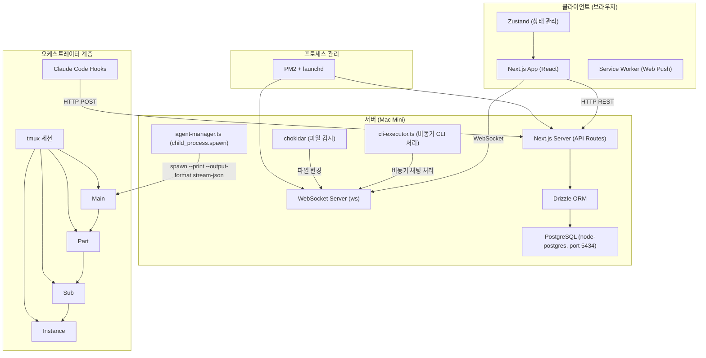
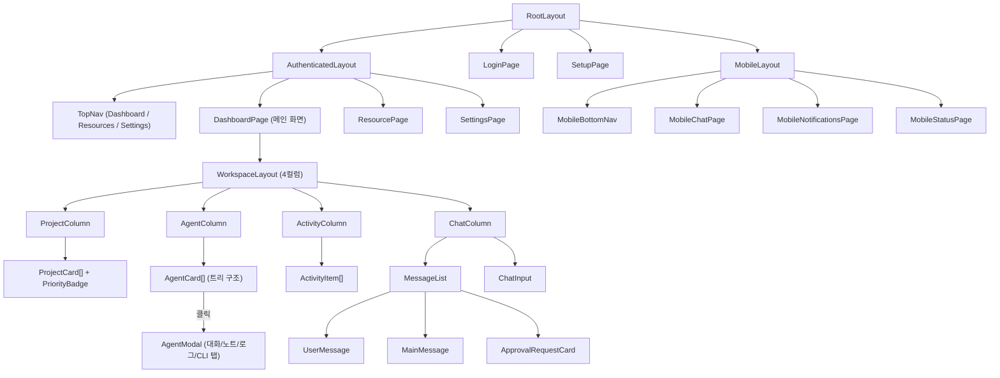
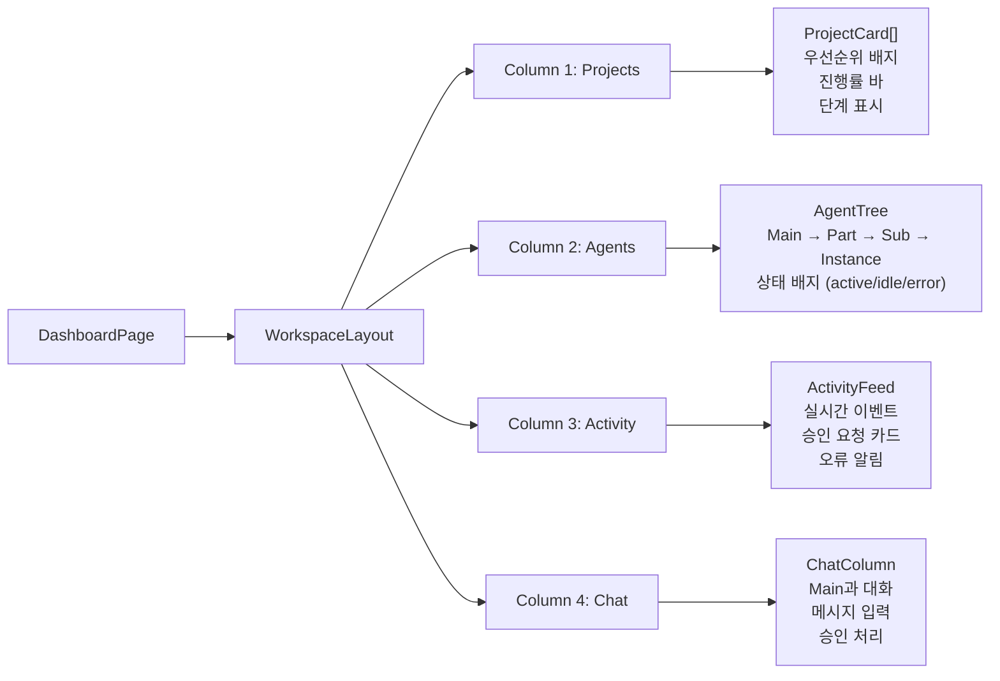
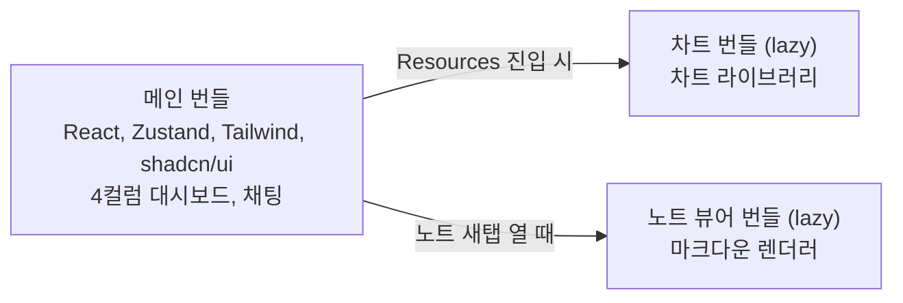
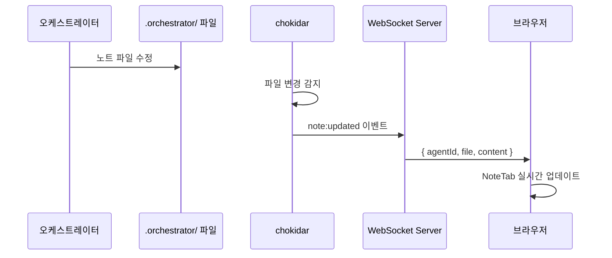
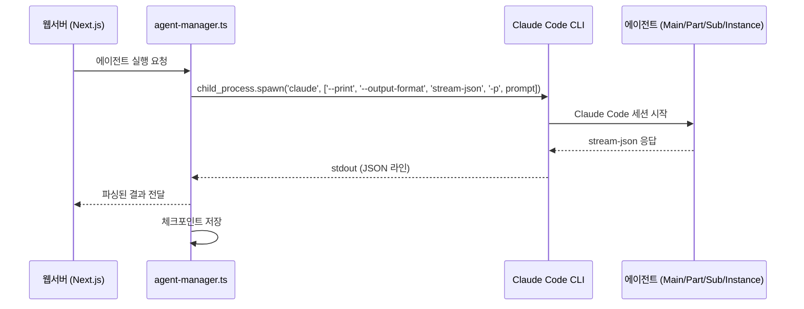

# 시스템 아키텍처
> 작성: designer | 상태: 작성 완료
> Next.js App Router 기반 프론트엔드 + 백엔드 아키텍처

---

## 0. 외부 경계 — YJ Manager / 자매 프로그램 권한 경계

> 참조 결정: [`02_concept/📌 DR002-yj-manager-permission-boundary.md`](../02_concept/📌%20DR002-yj-manager-permission-boundary.md) (옵션 A — 완전 격리, 2026-04-22 결정 완료)
> 선행 결정: [`02_concept/📌 DR001-yj-manager-hierarchy.md`](../02_concept/📌%20DR001-yj-manager-hierarchy.md) (관리 책임 3계층)

### 0-1. 전제 — ClaudeManager의 위치

ClaudeManager는 **YJ Manager가 관리하는 자매 프로그램 중 하나**일 뿐이며, 다른 자매 프로그램(MyLife Friend, Location, Finance Bot, 05.Finance 워크스페이스 등)을 **총괄하지 않는다**. 자매 프로그램들은 서로 동등한 레벨이며, YJ Manager가 각각에 대한 외부 접근 권한의 원천이다. ClaudeManager는 자기 자신의 프로젝트 운영에만 책임을 진다.

### 0-2. 완전 격리 원칙 (DR002)

자매 프로그램 간 교차 접근은 **읽기·쓰기 모두 기본 차단**한다.

| 항목 | 원칙 |
|---|---|
| **기본 동작** | 자매 프로그램 A가 자매 프로그램 B의 폴더·자원·데이터를 읽거나 쓰는 것을 **기본 차단**한다. |
| **ClaudeManager Sub 접근 범위** | **자기 프로젝트 폴더로 한정**한다. ClaudeManager 프로젝트 루트 밖 경로(예: Finance Bot 폴더, MyLife Friend 폴더, 05.Finance 워크스페이스)는 읽기조차 자동 허용하지 않는다. |
| **화이트리스트 외 접근 시도** | 감사 로그(YJ Manager 로그)에 기록하고 동작을 **차단**한다. 실수든 고의든 경계 밖 접근은 남기고 막는다. |
| **공유 필요 시** | **개별 예외 DR**을 작성하여 건별로 허용 여부를 판단한다. 자동 허용 경로는 존재하지 않는다. |

### 0-3. 경계의 의미

- 본 아키텍처 문서 §1 이하에서 기술되는 모든 구성요소(Next.js, WebSocket, agent-manager, Main/Part/Sub/Instance, Skill 등)는 **ClaudeManager 프로젝트 폴더 내부**에서 동작한다.
- 자매 프로그램과의 통신·공유가 필요하다는 요건이 등장하면, 기능 요건으로 구현하기 전에 **먼저 예외 DR을 발행**해야 한다.
- 금융 실행 등 특수 범주는 예외 DR로도 화이트리스트에 올리지 않는다(물리 차단 — DR002 §3 참조).
- 런타임 경계 체크의 구체 구현(CLAUDE.md / Skill 레벨 경로 검증 등)은 본 문서 범위 밖이며, DR002 §7 후속 작업으로 별도 설계한다.

---

## 1. 전체 아키텍처 개요



> **핵심 아키텍처 결정**: Claude API(토큰 과금)를 사용하지 않고, Claude Code CLI(구독 기반)만 사용.
> 웹서버 ↔ CLI 통신은 `child_process.spawn` + `--print --output-format stream-json`으로 구조화된 JSON 통신.
> CLI 탭(터미널)은 `osascript`로 macOS Terminal.app을 열어 `claude --resume` 세션에 직접 연결.

---

## 2. Next.js App Router 디렉토리 구조

```
src/
├── app/                          # Next.js App Router
│   ├── layout.tsx                # 루트 레이아웃 (Providers, 폰트)
│   ├── page.tsx                  # / 리다이렉트 (/dashboard 또는 /login)
│   ├── login/
│   │   └── page.tsx              # SCR-AUTH-001 로그인
│   ├── setup/
│   │   └── page.tsx              # SCR-AUTH-002 최초 설정
│   ├── (authenticated)/          # 인증 필요 라우트 그룹
│   │   ├── layout.tsx            # TopNav (Dashboard/Resources/Settings) + 인증 체크
│   │   ├── dashboard/
│   │   │   └── page.tsx          # SCR-DASH-001 4컬럼 SugarCRM 대시보드 (메인 화면)
│   │   ├── resources/
│   │   │   ├── page.tsx          # SCR-DATA-001 리소스 관리 메인
│   │   │   ├── approvals/
│   │   │   │   └── page.tsx      # SCR-DATA-002 승인 이력
│   │   │   ├── errors/
│   │   │   │   └── page.tsx      # SCR-DATA-003 오류 로그
│   │   │   └── audit/
│   │   │       └── page.tsx      # SCR-DATA-004 감사 로그
│   │   ├── settings/
│   │   │   └── page.tsx          # SCR-SETTINGS-001~004 설정
│   ├── m/                        # 모바일 전용 라우트
│   │   ├── layout.tsx            # 모바일 레이아웃 (BottomNav)
│   │   ├── chat/
│   │   │   └── page.tsx          # SCR-MOBILE-001 모바일 채팅
│   │   ├── notifications/
│   │   │   └── page.tsx          # SCR-MOBILE-002 모바일 알림
│   │   └── status/
│   │       └── page.tsx          # SCR-MOBILE-003 모바일 상태
│   └── api/                      # API Routes
│       ├── auth/
│       │   ├── login/route.ts
│       │   ├── setup/route.ts
│       │   └── refresh/route.ts
│       ├── agents/
│       │   ├── route.ts          # GET 에이전트 목록
│       │   ├── tree/route.ts     # GET 에이전트 트리
│       │   └── [id]/
│       │       ├── route.ts      # GET 에이전트 상세
│       │       ├── conversations/route.ts
│       │       ├── chat/route.ts         # POST 비동기 CLI 채팅
│       │       ├── open-terminal/route.ts # POST Terminal.app 열기
│       │       ├── notes/route.ts
│       │       └── logs/route.ts
│       ├── parts/
│       │   ├── route.ts          # GET 목록, POST 생성
│       │   └── [id]/
│       │       ├── route.ts
│       │       └── policy/route.ts
│       ├── skills/
│       │   ├── route.ts          # GET 목록
│       │   └── [name]/
│       │       ├── schema/route.ts
│       │       └── execute/route.ts
│       ├── chat/
│       │   ├── messages/route.ts
│       │   └── send/route.ts
│       ├── approvals/
│       │   ├── route.ts          # GET 목록
│       │   ├── pending/route.ts
│       │   └── [id]/
│       │       ├── approve/route.ts
│       │       ├── reject/route.ts
│       │       └── modify/route.ts
│       ├── cost/
│       │   ├── summary/route.ts
│       │   ├── by-model/route.ts
│       │   ├── trend/route.ts
│       │   └── by-key/route.ts
│       ├── reports/
│       │   ├── progress/route.ts
│       │   ├── decisions/route.ts
│       │   └── flow/route.ts
│       ├── notifications/
│       │   ├── route.ts
│       │   └── mark-read/route.ts
│       ├── settings/route.ts
│       ├── apikeys/
│       │   ├── route.ts
│       │   └── [id]/route.ts
│       ├── backups/
│       │   ├── route.ts
│       │   ├── manual/route.ts
│       │   └── [id]/
│       │       └── restore/route.ts
│       ├── system/
│       │   └── health/
│       │       ├── route.ts
│       │       └── history/route.ts
│       ├── audit/route.ts
│       ├── logs/
│       │   └── errors/route.ts
│       └── hooks/
│           └── event/route.ts    # Claude Code Hooks 수신
│
├── components/                   # 공유 컴포넌트
│   ├── ui/                       # shadcn/ui 기반 원자 컴포넌트
│   │   ├── button.tsx
│   │   ├── card.tsx
│   │   ├── input.tsx
│   │   ├── select.tsx
│   │   ├── modal.tsx
│   │   ├── toast.tsx
│   │   ├── badge.tsx
│   │   ├── tabs.tsx
│   │   ├── table.tsx
│   │   ├── progress.tsx
│   │   ├── toggle.tsx
│   │   ├── dropdown.tsx
│   │   └── skeleton.tsx
│   ├── layout/                   # 레이아웃 컴포넌트
│   │   ├── TopNav.tsx            # 3탭: Dashboard / Resources / Settings
│   │   ├── MobileBottomNav.tsx
│   │   └── SplitView.tsx
│   ├── chat/                     # 채팅 컴포넌트
│   │   ├── MessageList.tsx
│   │   ├── UserMessage.tsx
│   │   ├── MainMessage.tsx
│   │   ├── ChatInput.tsx
│   │   ├── TypingIndicator.tsx
│   │   ├── ApprovalRequestCard.tsx
│   │   ├── InlineProgressCard.tsx
│   │   └── MarkdownRenderer.tsx
│   ├── workspace/                # SugarCRM 4컬럼 대시보드 컴포넌트
│   │   ├── WorkspaceLayout.tsx   # 4컬럼 레이아웃 (Projects / Agents / Activity / Chat)
│   │   ├── ProjectColumn.tsx     # 프로젝트 카드 목록 + 우선순위 표시
│   │   ├── AgentColumn.tsx       # 에이전트 트리 + 상태 배지
│   │   ├── ActivityColumn.tsx    # 실시간 활동 피드
│   │   ├── ChatColumn.tsx        # Main 채팅 영역
│   │   ├── ProjectCard.tsx       # 프로젝트 요약 카드
│   │   ├── AgentCard.tsx         # 에이전트 상태 카드
│   │   ├── ActivityItem.tsx      # 활동 피드 아이템
│   │   └── PriorityBadge.tsx     # 우선순위 배지 (🔴🟠🔵⚪)
│   ├── agent/                    # 에이전트 상세 컴포넌트
│   │   ├── AgentModal.tsx
│   │   ├── AgentHeader.tsx
│   │   ├── ConversationTab.tsx
│   │   ├── NoteTab.tsx
│   │   ├── LogTab.tsx
│   │   └── TerminalTab.tsx       # CLI 탭 (Terminal.app 열기 버튼)
│   ├── note/                     # 노트 뷰 컴포넌트
│   │   ├── NoteViewer.tsx        # Obsidian 스타일 노트 뷰어
│   │   ├── FolderTree.tsx        # 폴더 트리 네비게이션
│   │   └── NoteRenderer.tsx      # 마크다운 렌더링 (이미지, PDF Phase 2)
│   ├── report/                   # 리포트 컴포넌트
│   │   ├── ReportNav.tsx
│   │   ├── ProgressReport.tsx
│   │   ├── DecisionHistory.tsx
│   │   ├── FlowTreeView.tsx
│   │   └── ReportCard.tsx
│   ├── data/                     # 데이터 뷰 컴포넌트
│   │   ├── CostSummaryBar.tsx
│   │   ├── ModelUsageChart.tsx
│   │   ├── CostTrendChart.tsx
│   │   ├── DataTable.tsx
│   │   └── FilterPanel.tsx
│   ├── settings/                 # 설정 컴포넌트
│   │   ├── SettingsModal.tsx
│   │   ├── GlobalSettingsForm.tsx
│   │   ├── PartPolicyForm.tsx
│   │   ├── ApiKeyTable.tsx
│   │   └── BackupPanel.tsx
│   ├── notification/             # 알림 컴포넌트
│   │   ├── NotificationDropdown.tsx
│   │   ├── NotificationItem.tsx
│   │   └── ToastContainer.tsx
│   ├── system/                   # 시스템 모니터링
│   │   ├── HealthPanel.tsx
│   │   └── ResourceGauge.tsx
│   ├── skill/                    # Skill 컴포넌트
│   │   ├── SkillLibraryModal.tsx
│   │   ├── SkillCard.tsx
│   │   └── SkillFormModal.tsx
│   └── mobile/                   # 모바일 전용 컴포넌트
│       ├── MobileStatusCard.tsx
│       ├── MobileNotificationList.tsx
│       └── ConnectionBanner.tsx
│
├── stores/                       # Zustand 상태 관리
│   ├── authStore.ts
│   ├── agentStore.ts
│   ├── workspaceStore.ts         # 4컬럼 대시보드 상태 (officeStore 대체)
│   ├── chatStore.ts
│   ├── approvalStore.ts
│   ├── partStore.ts
│   ├── skillStore.ts
│   ├── reportStore.ts
│   ├── costStore.ts
│   ├── notificationStore.ts
│   ├── settingsStore.ts
│   ├── systemStore.ts
│   ├── terminalStore.ts
│   ├── agentDetailStore.ts
│   └── priorityStore.ts         # 프로젝트 우선순위 관리
│
├── lib/                          # 유틸리티 / 서비스
│   ├── api.ts                    # API 클라이언트 (fetch wrapper + JWT)
│   ├── ws.ts                     # WebSocket 클라이언트 (자동 재연결)
│   ├── auth.ts                   # 인증 헬퍼 (JWT 검증, 미들웨어)
│   ├── db.ts                     # Drizzle ORM 인스턴스
│   ├── schema.ts                 # Drizzle 스키마 정의
│   ├── hooks-handler.ts          # Claude Code Hooks 이벤트 처리
│   ├── agent-manager.ts          # child_process.spawn + CLI JSON 통신
│   ├── terminal-manager.ts       # tmux 세션 관리
│   ├── checkpoint-manager.ts     # 에이전트 체크포인트 저장/복원
│   ├── execution-queue.ts        # 우선순위 기반 실행 큐
│   ├── file-watcher.ts           # chokidar 파일 감시
│   ├── notification.ts           # Web Push 관리
│   ├── backup.ts                 # 백업/복원 로직
│   ├── health.ts                 # 시스템 헬스 수집
│   ├── crypto.ts                 # AES-256-GCM 암호화
│   └── constants.ts              # 상수 정의
│
├── hooks/                        # React 커스텀 훅
│   ├── useWebSocket.ts           # WebSocket 연결 관리
│   ├── useAuth.ts                # 인증 상태
│   ├── useMediaQuery.ts          # 반응형 감지
│   └── useTerminal.ts            # 터미널 세션 관리
│
├── styles/
│   ├── globals.css               # Tailwind + 디자인 토큰
│   └── tokens.css                # CSS Custom Properties
│
├── types/                        # TypeScript 타입 정의
│   ├── agent.ts
│   ├── chat.ts
│   ├── approval.ts
│   ├── skill.ts
│   ├── cost.ts
│   ├── notification.ts
│   ├── settings.ts
│   └── ws-events.ts
│
└── public/
    ├── sw.js                     # Service Worker (Web Push)
    └── manifest.json             # PWA manifest
```

---

## 3. 컴포넌트 계층 구조



---

## 4. 상태 관리 설계 (Zustand Stores)

### Store 분리 원칙
- 도메인별로 독립 Store 분리
- Store 간 의존성 최소화
- WebSocket 이벤트는 전용 미들웨어에서 Store 업데이트

| Store | 책임 | 주요 상태 |
|---|---|---|
| `useAuthStore` | 인증 | token, isAuthenticated, login(), logout() |
| `useAgentStore` | 에이전트 트리 | agents[], tree, getAgent(id) |
| `useWorkspaceStore` | 4컬럼 대시보드 | selectedProject, columnLayout, sortOrder, filterState |
| `usePriorityStore` | 우선순위 관리 | priorities, updatePriority(), reorderProjects() |
| `useChatStore` | 채팅 | messages[], input, sendMessage(), loadMore() |
| `useApprovalStore` | 승인 | pendingList[], approve(), reject(), modify() |
| `usePartStore` | Part 관리 | parts[], selectedPart, createPart() |
| `useSkillStore` | Skill | skills[], selectedSkill, formData, execute() |
| `useReportStore` | 리포트 | selectedType, dateRange, reports[] |
| `useCostStore` | 비용 | summary, byModel, trend, period |
| `useNotificationStore` | 알림 | notifications[], unreadCount, markRead() |
| `useSettingsStore` | 설정 | globalSettings, updateSettings() |
| `useSystemStore` | 시스템 헬스 | health, recoveryStatus |
| `useTerminalStore` | 터미널 | sessionId, connected, send() |
| `useAgentDetailStore` | 에이전트 상세 | selectedAgent, activeTab |

---

## 5. WebSocket 메시지 프로토콜

### 메시지 포맷

```typescript
interface WSMessage {
  type: string;       // 이벤트 타입
  payload: unknown;   // 이벤트 데이터
  timestamp: string;  // ISO 8601
}
```

### 이벤트 목록

| 방향 | type | payload | 설명 |
|---|---|---|---|
| S->C | `agent:status` | `{ agentId, status, message? }` | 에이전트 상태 변경 |
| S->C | `agent:message` | `{ agentId, text, type }` | 에이전트 말풍선 메시지 |
| S->C | `agent:created` | `{ agent }` | 새 에이전트 생성 |
| S->C | `agent:removed` | `{ agentId }` | 에이전트 제거 |
| S->C | `chat:message` | `{ id, sender, content, type }` | 채팅 메시지 수신 |
| S->C | `chat:typing` | `{ isTyping }` | Main 타이핑 상태 |
| S->C | `chat:stream` | `{ agentId, token, done }` | 에이전트별 스트리밍 응답 |
| C->S | `chat:send` | `{ content }` | 채팅 메시지 전송 |
| S->C | `approval:request` | `{ id, source, content, urgency }` | 승인 요청 |
| S->C | `approval:resolved` | `{ id, result }` | 승인 처리 완료 |
| S->C | `project:progress` | `{ projectId, stage, percentage }` | 프로젝트 진행 |
| S->C | `part:created` | `{ part }` | Part 생성 |
| S->C | `notification:new` | `{ notification }` | 새 알림 |
| S->C | `cost:updated` | `{ summary }` | 비용 업데이트 |
| S->C | `system:health` | `{ cpu, memory, disk, network }` | 시스템 헬스 |
| S->C | `system:recovery` | `{ phase, progress, agents[] }` | 서버 복구 진행 |
| S->C | `note:updated` | `{ agentId, file, content }` | 노트 파일 변경 |
| S->C | `log:new` | `{ agentId, entry }` | 새 로그 엔트리 |
| S->C | `terminal:output` | `{ sessionId, data }` | 터미널 stdout |
| C->S | `terminal:input` | `{ sessionId, data }` | 터미널 stdin |
| C->S | `terminal:resize` | `{ sessionId, cols, rows }` | 터미널 크기 조정 |

### 재연결 전략
- 연결 끊김 시 exponential backoff로 자동 재연결
- 초기 간격: 1초, 최대 간격: 30초
- 재연결 시 미수신 이벤트 동기화 요청

---

## 6. 대시보드 UI 아키텍처 (SugarCRM 4컬럼)



### 컬럼 인터랙션
- **Projects 컬럼**: 프로젝트 카드 클릭 → 상세 모달, 우선순위 드래그 재정렬, 우선순위 드롭다운 변경
- **Agents 컬럼**: 에이전트 카드 클릭 → AgentModal (대화/노트/로그/CLI 탭), 트리 접기/펼치기
- **Activity 컬럼**: 실시간 활동 피드 자동 스크롤, 승인 요청 인라인 처리
- **Chat 컬럼**: Main과 직접 대화, Skill 실행 트리거, 지시/질문/피드백

### 우선순위 시스템 (4단계)
| 레벨 | 표시 | 동작 |
|---|---|---|
| 🔴 Urgent | 빨간 배지 | 즉시 실행, 기존 작업 선점, 알림 발송 |
| 🟠 High | 주황 배지 | 우선 실행 |
| 🔵 Normal | 파란 배지 | 기본 순서 |
| ⚪ Low | 회색 배지 | 유휴 시 실행 |

---

## 7. API 라우트 설계 요약

| 그룹 | 엔드포인트 수 | 주요 경로 |
|---|---|---|
| auth | 3 | /api/auth/login, setup, refresh |
| agents | 7 | /api/agents, tree, :id, conversations, :id/chat, :id/open-terminal, notes, logs |
| parts | 3 | /api/parts, :id, :id/policy |
| skills | 3 | /api/skills, :name/schema, :name/execute |
| chat | 2 | /api/chat/messages, send |
| approvals | 5 | /api/approvals, pending, :id/approve, reject, modify |
| cost | 4 | /api/cost/summary, by-model, trend, by-key |
| reports | 3 | /api/reports/progress, decisions, flow |
| notifications | 2 | /api/notifications, mark-read |
| settings | 1 | /api/settings |
| apikeys | 2 | /api/apikeys, :id |
| backups | 0 | (Phase 3에서 삭제됨) |
| system | 2 | /api/system/health, health/history |
| audit | 1 | /api/audit |
| logs | 1 | /api/logs/errors |
| hooks | 1 | /api/hooks/event |
| **합계** | **40** | |

---

## 8. 미들웨어

### 인증 미들웨어
- `/api/*` (auth 제외) 요청에 JWT 검증
- 토큰 만료: 7일, 자동 갱신
- 미인증 시 401 응답

### 에러 핸들링 미들웨어
- 공통 에러 응답 포맷: `{ error: { code, message, details? } }`
- 에러 코드 체계: `AUTH_XXX`, `AGENT_XXX`, `SKILL_XXX`, `SYSTEM_XXX`

### CORS / 보안
- 로컬 전용 (Phase A): localhost만 허용
- Phase B: Cloudflare Tunnel 경유, 특정 도메인만 허용

---

## 9. 번들 분리 전략



### 번들 규칙
- **메인 번들**: React, Zustand, Tailwind, shadcn/ui, 4컬럼 대시보드, 채팅 컴포넌트 (모든 플랫폼)
- **차트 번들**: 차트 라이브러리 (Resources 페이지 진입 시만 로딩)
- **노트 뷰어 번들**: 마크다운 렌더러 (노트 새탭 열 때만 로딩)
- CLI 탭은 Terminal.app을 여는 방식이므로 별도 번들 불필요

---

## 10. 데이터 흐름

### Hooks 이벤트 -> 이중 저장 -> 클라이언트

```mermaid
sequenceDiagram
    participant CC as Claude Code (에이전트)
    participant Hook as Hooks (HTTP POST)
    participant API as Next.js API
    participant DB as PostgreSQL
    participant Note as .orchestrator/ 노트
    participant WS as WebSocket Server
    participant Client as 브라우저

    CC->>Hook: 이벤트 발생 (작업 완료, 오류 등)
    Hook->>API: POST /api/hooks/event
    API->>DB: 이벤트 데이터 DB 저장
    API->>Note: 노트 파일 업데이트
    API->>WS: WebSocket 이벤트 발행
    WS->>Client: agent:status / chat:message 등
    Client->>Client: Zustand Store 업데이트
    Client->>Client: UI 리렌더링 (대시보드, 채팅, 알림)
```

### chokidar 파일 감시 -> 실시간 노트 반영



---

## 11. 에이전트 실행 아키텍처

### agent-manager.ts 통신 흐름



### 용도별 통신 방식

| 용도 | 방식 | 설명 |
|---|---|---|
| 에이전트 실행/대화 | `child_process.spawn` | `--print --output-format stream-json` |
| 에이전트 비동기 채팅 | `cli-executor.ts` (WS 서버 내) | WebSocket `chat:stream` 이벤트로 스트리밍 |
| CLI 탭 (터미널 열기) | `osascript` → Terminal.app | `claude --resume <sessionId>` 로 세션 연결 |
| Hooks 이벤트 수신 | HTTP POST | Claude Code Hooks → API Route |

### 에이전트 계층 실행

```
사용자 → 웹 UI (채팅)
  → agent-manager.ts
    → spawn Main (Claude Code CLI)
      → Main이 Part 생성 (spawn)
        → Part가 Sub 생성 (spawn)
          → Sub가 Instance 생성 (spawn)
```

모든 에이전트는 Claude Code CLI 프로세스이며, tmux 세션으로 관리됨.
PM2가 웹서버 프로세스를 감시하고, 웹서버가 agent-manager를 통해 에이전트 프로세스를 관리.

### 안정성 설계 (요약)
- **프로세스 복구**: PM2 + tmux + checkpoint 기반 자동 복구
- **메시지 영속성**: DB write-ahead, 상태 추적 (created→sent→delivered→processed)
- **결과 검증**: 파일 존재, 빌드, 테스트, 스코프 자동 검증
- **컨텍스트 보존**: CLAUDE.md + checkpoint + DB 이력 3계층
- **파일 충돌 방지**: 에이전트별 워크스페이스 분리
- **오류 격리**: Instance→Sub→Part→Main→User 에스컬레이션 체인
- **Rate Limit 관리**: 동시 실행 제한 (기본 3), 우선순위 기반 실행 큐

> 상세 안정성 설계는 `🔧 tech-decisions.md` 섹션 15 참조
