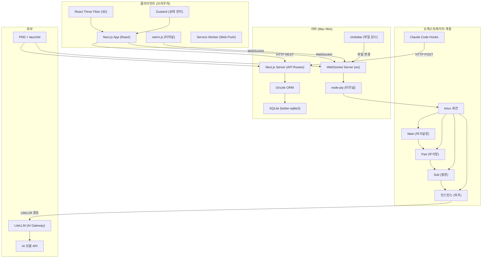
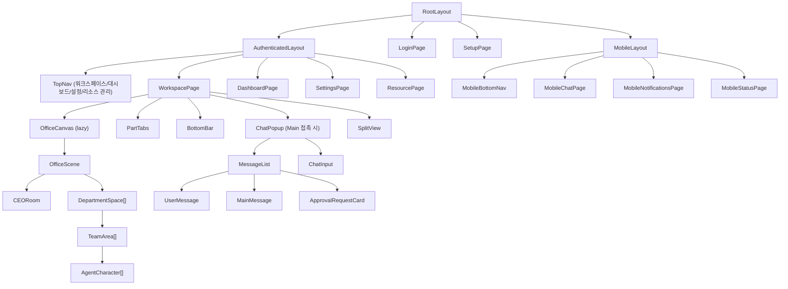
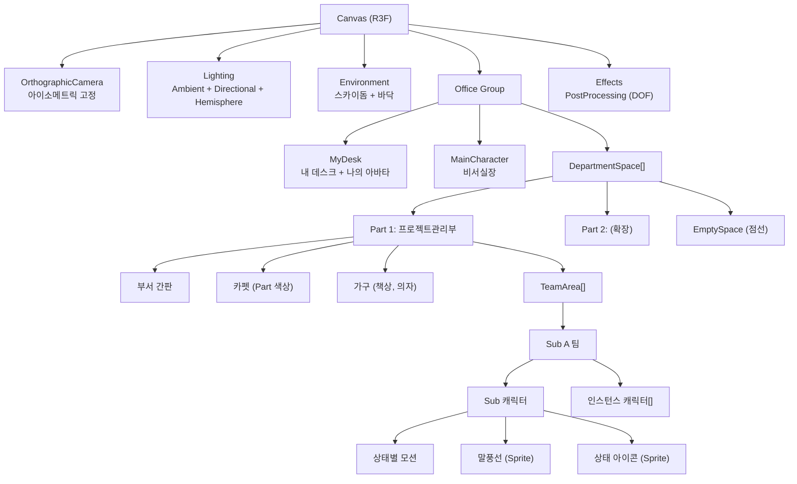
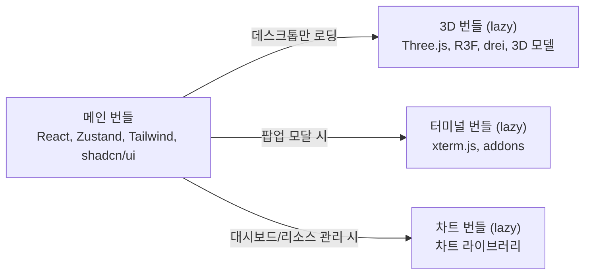
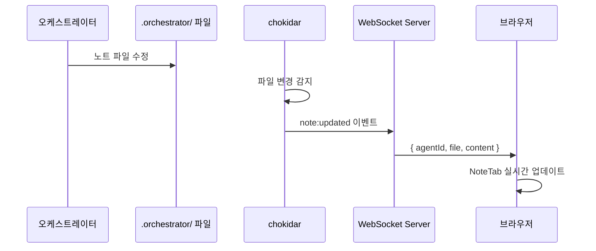

# 시스템 아키텍처
> 작성: designer | 상태: 작성 완료
> Next.js App Router 기반 프론트엔드 + 백엔드 아키텍처

---

## 1. 전체 아키텍처 개요



---

## 2. Next.js App Router 디렉토리 구조

```
src/
├── app/                          # Next.js App Router
│   ├── layout.tsx                # 루트 레이아웃 (Providers, 폰트)
│   ├── page.tsx                  # / 리다이렉트 (/office 또는 /login)
│   ├── login/
│   │   └── page.tsx              # SCR-AUTH-001 로그인
│   ├── setup/
│   │   └── page.tsx              # SCR-AUTH-002 최초 설정
│   ├── (authenticated)/          # 인증 필요 라우트 그룹
│   │   ├── layout.tsx            # TopNav + 인증 체크
│   │   ├── workspace/
│   │   │   └── page.tsx          # SCR-OFFICE-001~005 워크스페이스 (채팅 팝업 포함)
│   │   ├── dashboard/
│   │   │   ├── page.tsx          # SCR-REPORT-001~002 대시보드 (리포트 + 비용)
│   │   │   ├── flow/
│   │   │   │   └── page.tsx      # SCR-REPORT-003 대화 흐름 트리
│   │   │   └── cost/
│   │   │       └── page.tsx      # SCR-DATA-001 비용 대시보드
│   │   ├── settings/
│   │   │   └── page.tsx          # SCR-SETTINGS-001~004 설정
│   │   └── resources/
│   │       ├── page.tsx          # 리소스 관리 메인
│   │       ├── approvals/
│   │       │   └── page.tsx      # SCR-DATA-002 승인 이력
│   │       ├── errors/
│   │       │   └── page.tsx      # SCR-DATA-002 오류 로그
│   │       └── audit/
│   │           └── page.tsx      # SCR-DATA-002 감사 로그
│   ├── m/                        # 모바일 전용 라우트
│   │   ├── layout.tsx            # 모바일 레이아웃 (BottomNav)
│   │   ├── chat/
│   │   │   └── page.tsx          # SCR-MOBILE-001 모바일 채팅
│   │   ├── notifications/
│   │   │   └── page.tsx          # SCR-MOBILE-002 모바일 알림
│   │   └── status/
│   │       └── page.tsx          # SCR-MOBILE-003 모바일 상태
│   └── api/                      # API Routes
│       ├── auth/
│       │   ├── login/route.ts
│       │   ├── setup/route.ts
│       │   └── refresh/route.ts
│       ├── agents/
│       │   ├── route.ts          # GET 에이전트 목록
│       │   ├── tree/route.ts     # GET 에이전트 트리
│       │   └── [id]/
│       │       ├── route.ts      # GET 에이전트 상세
│       │       ├── conversations/route.ts
│       │       ├── notes/route.ts
│       │       └── logs/route.ts
│       ├── parts/
│       │   ├── route.ts          # GET 목록, POST 생성
│       │   └── [id]/
│       │       ├── route.ts
│       │       └── policy/route.ts
│       ├── skills/
│       │   ├── route.ts          # GET 목록
│       │   └── [name]/
│       │       ├── schema/route.ts
│       │       └── execute/route.ts
│       ├── chat/
│       │   ├── messages/route.ts
│       │   └── send/route.ts
│       ├── approvals/
│       │   ├── route.ts          # GET 목록
│       │   ├── pending/route.ts
│       │   └── [id]/
│       │       ├── approve/route.ts
│       │       ├── reject/route.ts
│       │       └── modify/route.ts
│       ├── cost/
│       │   ├── summary/route.ts
│       │   ├── by-model/route.ts
│       │   ├── trend/route.ts
│       │   └── by-key/route.ts
│       ├── reports/
│       │   ├── progress/route.ts
│       │   ├── decisions/route.ts
│       │   └── flow/route.ts
│       ├── notifications/
│       │   ├── route.ts
│       │   └── mark-read/route.ts
│       ├── settings/route.ts
│       ├── apikeys/
│       │   ├── route.ts
│       │   └── [id]/route.ts
│       ├── backups/
│       │   ├── route.ts
│       │   ├── manual/route.ts
│       │   └── [id]/
│       │       └── restore/route.ts
│       ├── system/
│       │   └── health/
│       │       ├── route.ts
│       │       └── history/route.ts
│       ├── audit/route.ts
│       ├── logs/
│       │   └── errors/route.ts
│       └── hooks/
│           └── event/route.ts    # Claude Code Hooks 수신
│
├── components/                   # 공유 컴포넌트
│   ├── ui/                       # shadcn/ui 기반 원자 컴포넌트
│   │   ├── button.tsx
│   │   ├── card.tsx
│   │   ├── input.tsx
│   │   ├── select.tsx
│   │   ├── modal.tsx
│   │   ├── toast.tsx
│   │   ├── badge.tsx
│   │   ├── tabs.tsx
│   │   ├── table.tsx
│   │   ├── progress.tsx
│   │   ├── toggle.tsx
│   │   ├── dropdown.tsx
│   │   └── skeleton.tsx
│   ├── layout/                   # 레이아웃 컴포넌트
│   │   ├── TopNav.tsx
│   │   ├── BottomBar.tsx
│   │   ├── PartTabs.tsx
│   │   ├── MobileBottomNav.tsx
│   │   └── SplitView.tsx
│   ├── chat/                     # 채팅 컴포넌트
│   │   ├── MessageList.tsx
│   │   ├── UserMessage.tsx
│   │   ├── MainMessage.tsx
│   │   ├── ChatInput.tsx
│   │   ├── TypingIndicator.tsx
│   │   ├── ApprovalRequestCard.tsx
│   │   ├── InlineProgressCard.tsx
│   │   └── MarkdownRenderer.tsx
│   ├── office/                   # 3D 워크스페이스 컴포넌트 (lazy load)
│   │   ├── OfficeCanvas.tsx
│   │   ├── OfficeScene.tsx
│   │   ├── CEORoom.tsx
│   │   ├── DepartmentSpace.tsx
│   │   ├── TeamArea.tsx
│   │   ├── AgentCharacter.tsx
│   │   ├── MainCharacter.tsx
│   │   ├── StatusEffects.tsx
│   │   ├── ParticleSystem.tsx
│   │   ├── SpeechBubble.tsx
│   │   ├── ConstructionAnimation.tsx
│   │   └── RecoveryScene.tsx
│   ├── agent/                    # 에이전트 상세 컴포넌트
│   │   ├── AgentModal.tsx
│   │   ├── AgentHeader.tsx
│   │   ├── ConversationTab.tsx
│   │   ├── NoteTab.tsx
│   │   ├── LogTab.tsx
│   │   └── TerminalTab.tsx
│   ├── report/                   # 리포트 컴포넌트
│   │   ├── ReportNav.tsx
│   │   ├── ProgressReport.tsx
│   │   ├── DecisionHistory.tsx
│   │   ├── FlowTreeView.tsx
│   │   └── ReportCard.tsx
│   ├── data/                     # 데이터 뷰 컴포넌트
│   │   ├── CostSummaryBar.tsx
│   │   ├── ModelUsageChart.tsx
│   │   ├── CostTrendChart.tsx
│   │   ├── DataTable.tsx
│   │   └── FilterPanel.tsx
│   ├── settings/                 # 설정 컴포넌트
│   │   ├── SettingsModal.tsx
│   │   ├── GlobalSettingsForm.tsx
│   │   ├── PartPolicyForm.tsx
│   │   ├── ApiKeyTable.tsx
│   │   └── BackupPanel.tsx
│   ├── notification/             # 알림 컴포넌트
│   │   ├── NotificationDropdown.tsx
│   │   ├── NotificationItem.tsx
│   │   └── ToastContainer.tsx
│   ├── system/                   # 시스템 모니터링
│   │   ├── HealthPanel.tsx
│   │   └── ResourceGauge.tsx
│   ├── skill/                    # Skill 컴포넌트
│   │   ├── SkillLibraryModal.tsx
│   │   ├── SkillCard.tsx
│   │   └── SkillFormModal.tsx
│   └── mobile/                   # 모바일 전용 컴포넌트
│       ├── MobileStatusCard.tsx
│       ├── MobileNotificationList.tsx
│       └── ConnectionBanner.tsx
│
├── stores/                       # Zustand 상태 관리
│   ├── authStore.ts
│   ├── agentStore.ts
│   ├── officeStore.ts
│   ├── chatStore.ts
│   ├── approvalStore.ts
│   ├── partStore.ts
│   ├── skillStore.ts
│   ├── reportStore.ts
│   ├── costStore.ts
│   ├── notificationStore.ts
│   ├── settingsStore.ts
│   ├── systemStore.ts
│   ├── terminalStore.ts
│   └── agentDetailStore.ts
│
├── lib/                          # 유틸리티 / 서비스
│   ├── api.ts                    # API 클라이언트 (fetch wrapper + JWT)
│   ├── ws.ts                     # WebSocket 클라이언트 (자동 재연결)
│   ├── auth.ts                   # 인증 헬퍼 (JWT 검증, 미들웨어)
│   ├── db.ts                     # Drizzle ORM 인스턴스
│   ├── schema.ts                 # Drizzle 스키마 정의
│   ├── hooks-handler.ts          # Claude Code Hooks 이벤트 처리
│   ├── terminal-manager.ts       # tmux + node-pty 관리
│   ├── file-watcher.ts           # chokidar 파일 감시
│   ├── notification.ts           # Web Push 관리
│   ├── backup.ts                 # 백업/복원 로직
│   ├── health.ts                 # 시스템 헬스 수집
│   ├── crypto.ts                 # AES-256-GCM 암호화
│   └── constants.ts              # 상수 정의
│
├── hooks/                        # React 커스텀 훅
│   ├── useWebSocket.ts           # WebSocket 연결 관리
│   ├── useAuth.ts                # 인증 상태
│   ├── useMediaQuery.ts          # 반응형 감지
│   └── useTerminal.ts            # xterm.js 관리
│
├── styles/
│   ├── globals.css               # Tailwind + 디자인 토큰
│   └── tokens.css                # CSS Custom Properties
│
├── types/                        # TypeScript 타입 정의
│   ├── agent.ts
│   ├── chat.ts
│   ├── approval.ts
│   ├── skill.ts
│   ├── cost.ts
│   ├── notification.ts
│   ├── settings.ts
│   └── ws-events.ts
│
└── public/
    ├── assets/
    │   └── models/               # 3D 모델 (.glb, Draco 압축)
    │       ├── characters/
    │       ├── furniture/
    │       └── environment/
    ├── sw.js                     # Service Worker (Web Push)
    └── manifest.json             # PWA manifest
```

---

## 3. 컴포넌트 계층 구조



---

## 4. 상태 관리 설계 (Zustand Stores)

### Store 분리 원칙
- 도메인별로 독립 Store 분리
- Store 간 의존성 최소화
- WebSocket 이벤트는 전용 미들웨어에서 Store 업데이트

| Store | 책임 | 주요 상태 |
|---|---|---|
| `useAuthStore` | 인증 | token, isAuthenticated, login(), logout() |
| `useAgentStore` | 에이전트 트리 | agents[], tree, getAgent(id) |
| `useOfficeStore` | 3D 워크스페이스 | cameraPosition, zoom, selectedCharacter, viewMode |
| `useChatStore` | 채팅 | messages[], input, sendMessage(), loadMore() |
| `useApprovalStore` | 승인 | pendingList[], approve(), reject(), modify() |
| `usePartStore` | Part 관리 | parts[], selectedPart, createPart() |
| `useSkillStore` | Skill | skills[], selectedSkill, formData, execute() |
| `useReportStore` | 리포트 | selectedType, dateRange, reports[] |
| `useCostStore` | 비용 | summary, byModel, trend, period |
| `useNotificationStore` | 알림 | notifications[], unreadCount, markRead() |
| `useSettingsStore` | 설정 | globalSettings, updateSettings() |
| `useSystemStore` | 시스템 헬스 | health, recoveryStatus |
| `useTerminalStore` | 터미널 | sessionId, connected, send() |
| `useAgentDetailStore` | 에이전트 상세 | selectedAgent, activeTab |

---

## 5. WebSocket 메시지 프로토콜

### 메시지 포맷

```typescript
interface WSMessage {
  type: string;       // 이벤트 타입
  payload: unknown;   // 이벤트 데이터
  timestamp: string;  // ISO 8601
}
```

### 이벤트 목록

| 방향 | type | payload | 설명 |
|---|---|---|---|
| S->C | `agent:status` | `{ agentId, status, message? }` | 에이전트 상태 변경 |
| S->C | `agent:message` | `{ agentId, text, type }` | 에이전트 말풍선 메시지 |
| S->C | `agent:created` | `{ agent }` | 새 에이전트 생성 |
| S->C | `agent:removed` | `{ agentId }` | 에이전트 제거 |
| S->C | `chat:message` | `{ id, sender, content, type }` | 채팅 메시지 수신 |
| S->C | `chat:typing` | `{ isTyping }` | Main 타이핑 상태 |
| C->S | `chat:send` | `{ content }` | 채팅 메시지 전송 |
| S->C | `approval:request` | `{ id, source, content, urgency }` | 승인 요청 |
| S->C | `approval:resolved` | `{ id, result }` | 승인 처리 완료 |
| S->C | `project:progress` | `{ projectId, stage, percentage }` | 프로젝트 진행 |
| S->C | `part:created` | `{ part }` | Part 생성 (건축 애니메이션) |
| S->C | `notification:new` | `{ notification }` | 새 알림 |
| S->C | `cost:updated` | `{ summary }` | 비용 업데이트 |
| S->C | `system:health` | `{ cpu, memory, disk, network }` | 시스템 헬스 |
| S->C | `system:recovery` | `{ phase, progress, agents[] }` | 서버 복구 진행 |
| S->C | `note:updated` | `{ agentId, file, content }` | 노트 파일 변경 |
| S->C | `log:new` | `{ agentId, entry }` | 새 로그 엔트리 |
| S->C | `terminal:output` | `{ sessionId, data }` | 터미널 stdout |
| C->S | `terminal:input` | `{ sessionId, data }` | 터미널 stdin |
| C->S | `terminal:resize` | `{ sessionId, cols, rows }` | 터미널 크기 조정 |

### 재연결 전략
- 연결 끊김 시 exponential backoff로 자동 재연결
- 초기 간격: 1초, 최대 간격: 30초
- 재연결 시 미수신 이벤트 동기화 요청

---

## 6. 3D 씬 아키텍처



### 3D 에셋 로딩 전략
- `React.lazy` + `Suspense`로 3D 모듈 코드 분할
- 모바일(768px 미만)에서는 3D 번들 자체를 로딩하지 않음
- `.glb` 모델은 Draco 압축 (용량 80% 절감)
- GPU 인스턴싱: 동일 모델 에이전트는 `InstancedMesh`로 일괄 렌더링
- LOD: 카메라 줌 거리에 따라 디테일 단계 조절

### Raycasting (접촉 감지)
- `@react-three/drei`의 `useRaycast` 사용
- 캐릭터 접촉 (내가 다가가서 접촉) -> React 상태 업데이트 -> `AgentModal` 표시
- Main 캐릭터 접촉 -> `ChatPopup` 표시 (채팅 팝업)
- 빈 공간 접촉 -> 선택 해제

---

## 7. API 라우트 설계 요약

| 그룹 | 엔드포인트 수 | 주요 경로 |
|---|---|---|
| auth | 3 | /api/auth/login, setup, refresh |
| agents | 5 | /api/agents, tree, :id, conversations, notes, logs |
| parts | 3 | /api/parts, :id, :id/policy |
| skills | 3 | /api/skills, :name/schema, :name/execute |
| chat | 2 | /api/chat/messages, send |
| approvals | 5 | /api/approvals, pending, :id/approve, reject, modify |
| cost | 4 | /api/cost/summary, by-model, trend, by-key |
| reports | 3 | /api/reports/progress, decisions, flow |
| notifications | 2 | /api/notifications, mark-read |
| settings | 1 | /api/settings |
| apikeys | 2 | /api/apikeys, :id |
| backups | 3 | /api/backups, manual, :id/restore |
| system | 2 | /api/system/health, health/history |
| audit | 1 | /api/audit |
| logs | 1 | /api/logs/errors |
| hooks | 1 | /api/hooks/event |
| **합계** | **41** | |

---

## 8. 미들웨어

### 인증 미들웨어
- `/api/*` (auth 제외) 요청에 JWT 검증
- 토큰 만료: 7일, 자동 갱신
- 미인증 시 401 응답

### 에러 핸들링 미들웨어
- 공통 에러 응답 포맷: `{ error: { code, message, details? } }`
- 에러 코드 체계: `AUTH_XXX`, `AGENT_XXX`, `SKILL_XXX`, `SYSTEM_XXX`

### CORS / 보안
- 로컬 전용 (Phase A): localhost만 허용
- Phase B: Cloudflare Tunnel 경유, 특정 도메인만 허용

---

## 9. 번들 분리 전략



### 번들 규칙
- **메인 번들**: React, Zustand, Tailwind, shadcn/ui, 채팅 컴포넌트 (모든 플랫폼)
- **3D 번들**: Three.js + R3F + drei + 3D 모델 (데스크톱 1024px 이상에서만 `dynamic import`)
- **터미널 번들**: xterm.js + addons (팝업 모달 터미널 탭 열 때만 로딩)
- **차트 번들**: 차트 라이브러리 (대시보드/리소스 관리 진입 시만 로딩)
- 모바일에서 3D 번들은 import 자체를 하지 않음 (`useMediaQuery` 기반 조건부 렌더링)

---

## 10. 데이터 흐름

### Hooks 이벤트 -> 이중 저장 -> 클라이언트

```mermaid
sequenceDiagram
    participant CC as Claude Code (에이전트)
    participant Hook as Hooks (HTTP POST)
    participant API as Next.js API
    participant DB as SQLite
    participant Note as .orchestrator/ 노트
    participant WS as WebSocket Server
    participant Client as 브라우저

    CC->>Hook: 이벤트 발생 (작업 완료, 오류 등)
    Hook->>API: POST /api/hooks/event
    API->>DB: 이벤트 데이터 DB 저장
    API->>Note: 노트 파일 업데이트
    API->>WS: WebSocket 이벤트 발행
    WS->>Client: agent:status / chat:message 등
    Client->>Client: Zustand Store 업데이트
    Client->>Client: UI 리렌더링 (3D 모션, 채팅, 알림)
```

### chokidar 파일 감시 -> 실시간 노트 반영


