# 사용자 흐름도 (User Flow)
> 작성: designer | 상태: 작성 완료
> 전체 사용자 여정과 주요 태스크 플로우를 정의

---

## 1. 전체 사용자 여정

### 1.1 최초 접속 -> 온보딩 -> 일상 운영

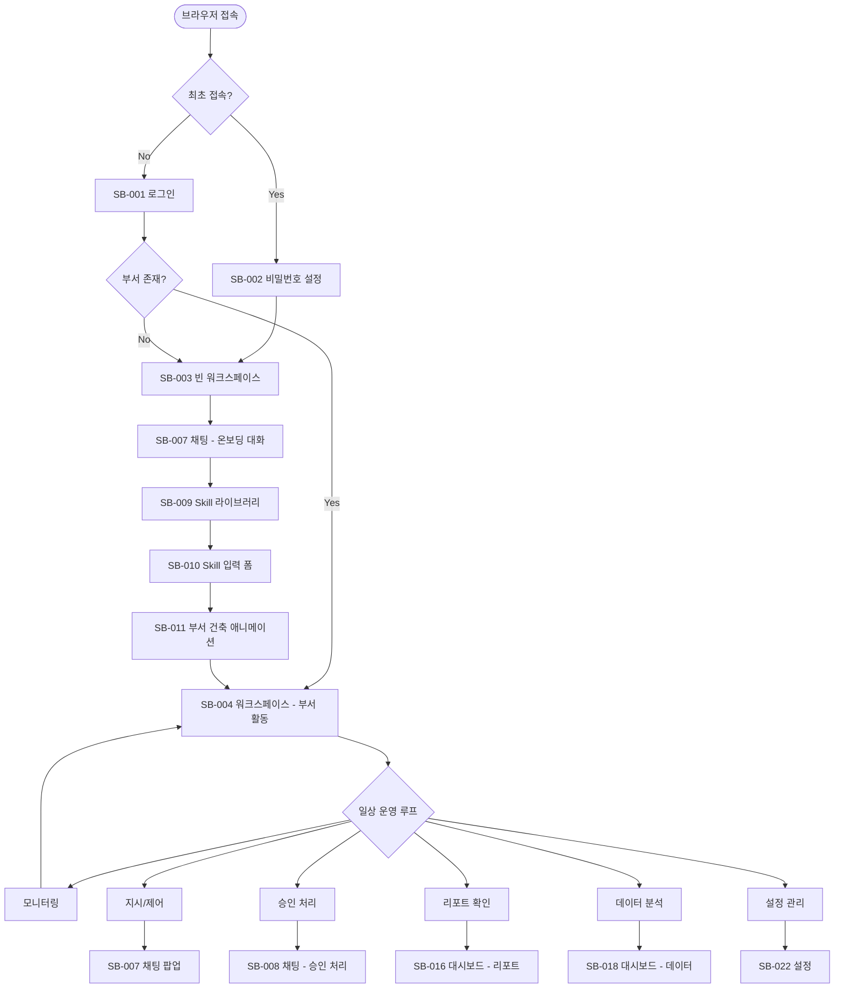

### 1.2 데스크톱 메인 뷰 전환 흐름

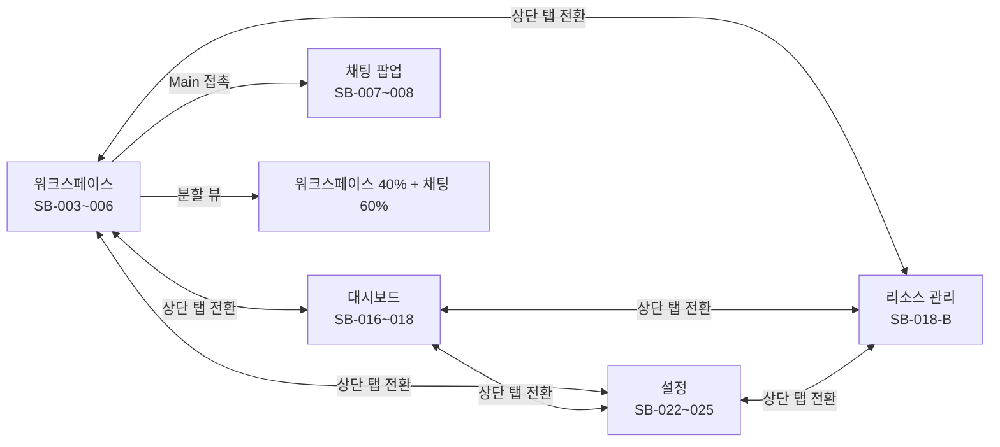

### 1.3 모바일 뷰 전환 흐름

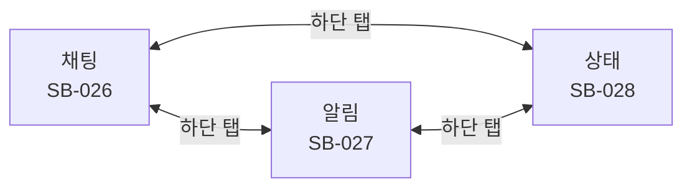

---

## 2. 주요 태스크 플로우

### 2.1 Part(부서) 생성 플로우

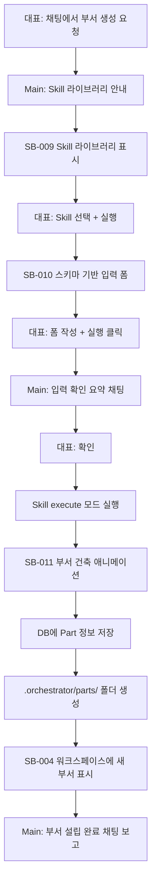

### 2.2 프로젝트 실행 플로우

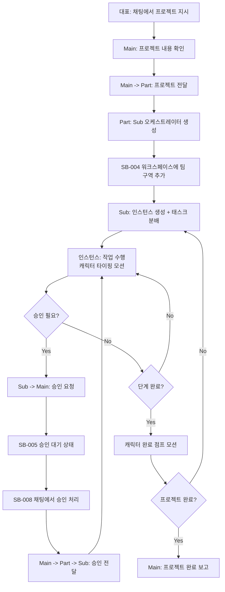

### 2.3 승인 처리 플로우

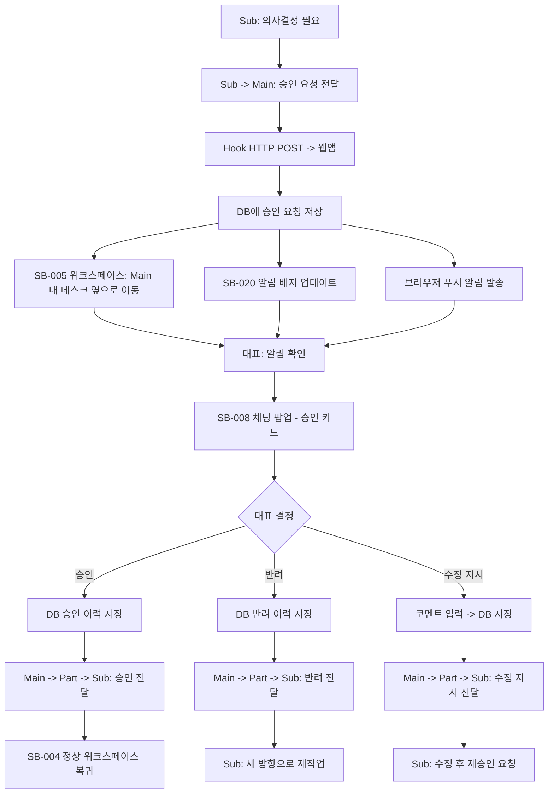

### 2.4 오류 대응 플로우

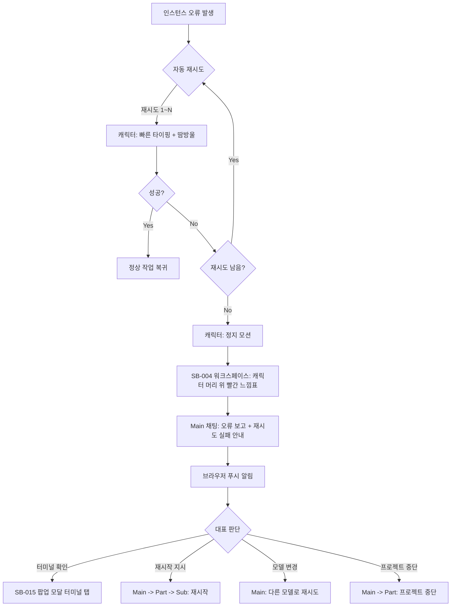

### 2.5 서버 복구 플로우

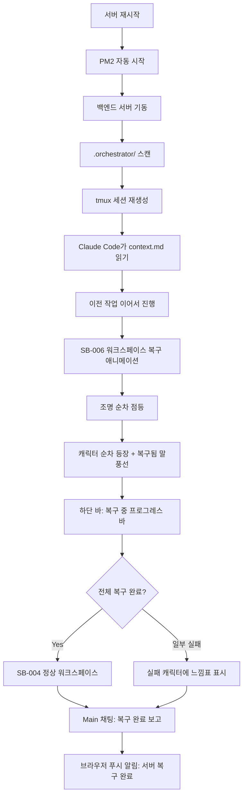

### 2.6 모바일 승인 처리 플로우

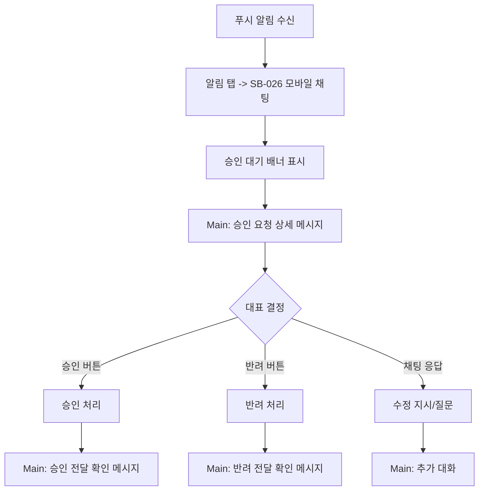

### 2.7 비용 모니터링 플로우

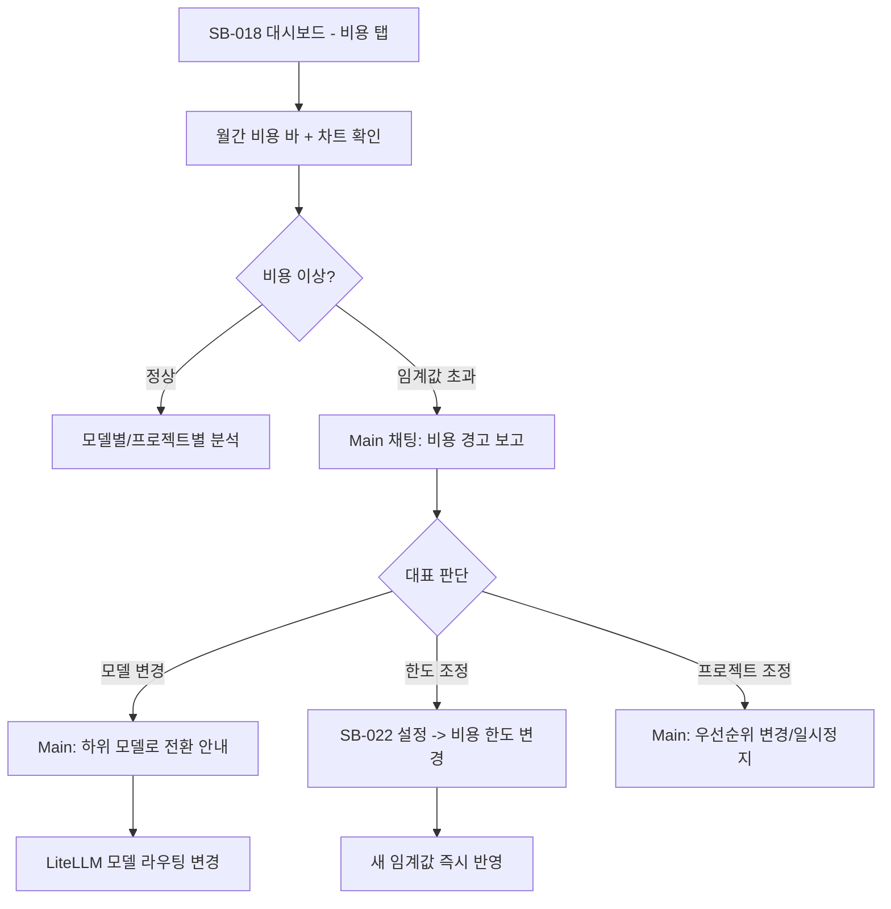

### 2.8 설정 변경 플로우

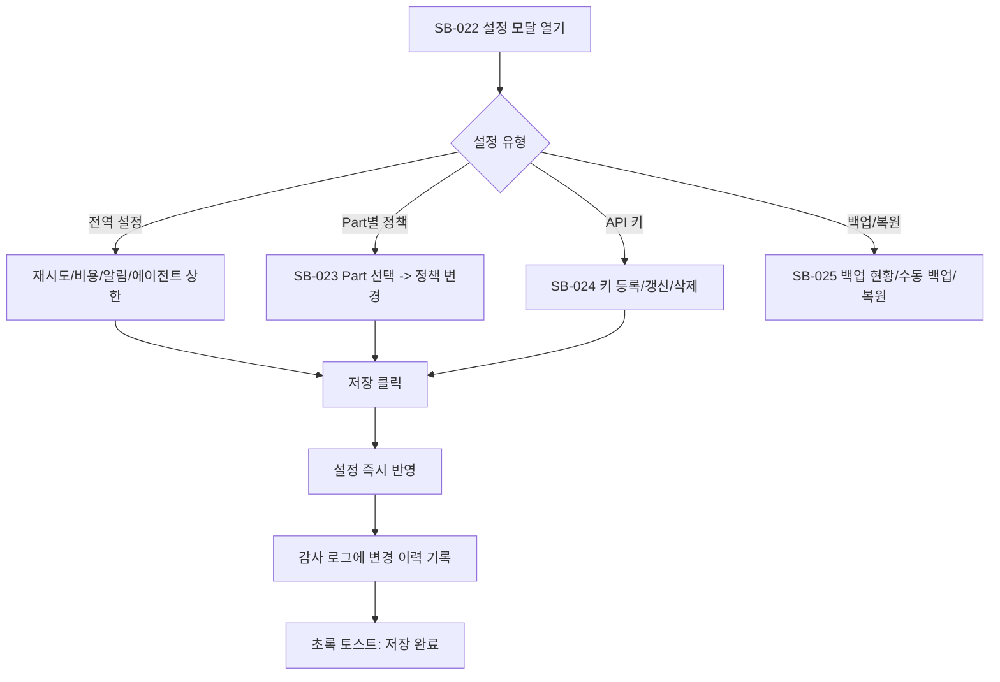

---

## 3. 화면 접근 맵

### 3.1 워크스페이스에서 접근 가능한 화면

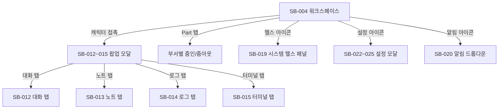

### 3.2 채팅 팝업에서 접근 가능한 화면

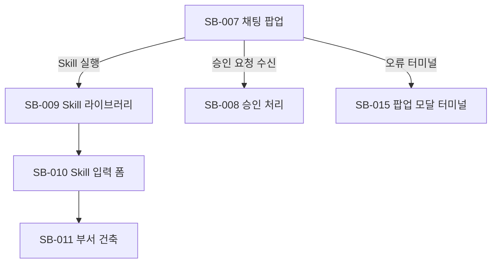

---

## 4. 데스크톱 / 모바일 분기

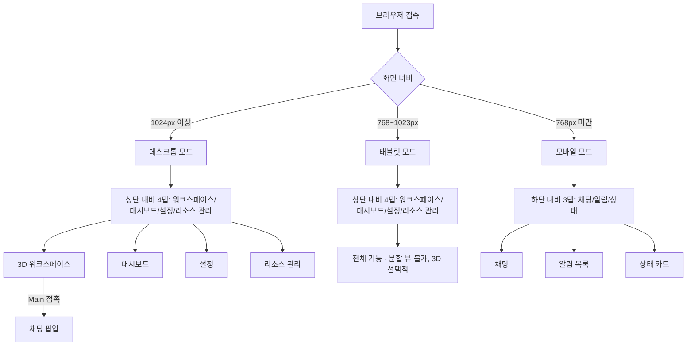

### 데스크톱 전용 기능
- 3D 워크스페이스 (Three.js + R3F)
- 채팅 팝업 (Main 접촉 시 열림)
- 분할 뷰 (워크스페이스 + 채팅)
- 팝업 모달 (캐릭터 접촉 - 대화/노트/로그/터미널)
- 대시보드 (리포트 + 비용/로그/감사이력)
- 시스템 헬스 패널
- 설정 (상단 탭)
- 리소스 관리 (상단 탭)
- 대화 흐름 트리 뷰

### 모바일 전용 기능
- 하단 3탭 내비게이션 (채팅/알림/상태)
- 상태 카드 뷰 (Part/Sub별 요약 카드)
- 인라인 승인 버튼 (채팅 내)
- 간소화된 알림 목록

### 공통 기능
- 로그인/비밀번호 설정
- 채팅 (Main과 대화 — 데스크톱: 워크스페이스 내 팝업, 모바일: 별도 화면)
- 승인 처리 (채팅 내 버튼)
- 푸시 알림 수신

---

## 5. 시나리오별 화면 흐름 매핑

| 시나리오 | 주요 화면 흐름 | 분기 |
|---|---|---|
| SC-001 온보딩 | SB-001 -> SB-002 -> SB-003 -> SB-007 | 최초만 SB-002 |
| SC-002 Part 생성 | SB-007 -> SB-009 -> SB-010 -> SB-011 -> SB-004 | |
| SC-003 프로젝트 진행 | SB-007 -> SB-004 (캐릭터 활동) | |
| SC-004 승인 처리 | SB-005 -> SB-008 -> SB-007 | |
| SC-005 활동 열람 | SB-004 -> SB-012 -> SB-013/014/015 | 탭 선택 |
| SC-006 오류/재시도 | SB-004(오류 연출) -> SB-007 -> SB-015 | |
| SC-007 비용 모니터링 | SB-018 -> SB-007 (모델 변경 대화) | |
| SC-008 리포트 열람 | SB-016 -> SB-017 -> SB-007 | |
| SC-009 모바일 승인 | SB-026 (승인 처리) | 모바일 전용 |
| SC-010 서버 복구 | SB-006 -> SB-004 | |
| SC-011 API 키 관리 | SB-007 (대화) + SB-024 | |
| SC-012 설정 변경 | SB-022 -> SB-023 | |
| SC-013 능동적 지시 | SB-007 | |
| SC-014 검색/필터링 | SB-018-B | |
| SC-015 백업/복원 | SB-025 | |
| SC-016 리소스 관리 | SB-007 + SB-022 | |
| SC-017 시스템 헬스 | SB-019 | |
| SC-018 Skill 작성 | SB-007 -> SB-009 -> SB-010 -> SB-011 | |
| SC-019 생명주기 관리 | SB-007 -> SB-004 | |
| SC-020 마이그레이션 | SB-007 (대화) + CLI | |
| SC-021 인프라 배포 | CLI -> SB-001 -> SB-003/SB-006 | |
| SC-022 대화 흐름 추적 | SB-021 -> SB-012 | |
| SC-023 이중 저장 | SB-004 + SB-016 (실시간 반영) | |
| SC-024 알림 트리거 | SB-020 -> 각 상세 화면 | |
| SC-025 뷰 전환 | SB-004 <-> SB-007 <-> SB-016 <-> SB-018 | |
| SC-026 AI Gateway | SB-007 (모델 추천 대화) + SB-018 | |
| SC-027 모바일 뷰 | SB-026 -> SB-027 -> SB-028 | 모바일 전용 |
| SC-028 민감도 관리 | SB-023 + SB-007 | |
| SC-029 노트 구조 | SB-013 (노트 탭) | |
