# 사용자 흐름도 (User Flow)
> 작성: designer | 상태: 작성 완료
> 전체 사용자 여정과 주요 태스크 플로우를 정의

---

## 1. 전체 사용자 여정

### 1.0 관리 책임 3계층 사용 흐름 (DR001 반영)

> 참조: [02_concept/📌 DR001-yj-manager-hierarchy.md](../02_concept/📌%20DR001-yj-manager-hierarchy.md) §4 사용 흐름

ClaudeManager는 **Main(초기 구성)** → **Sub(프로젝트 수행)** → **ClaudeManager 전체(감독)** 의 3단계 흐름으로 사용된다. 사용자가 각 단계에서 **누구와 대화하는가** 가 다르다.

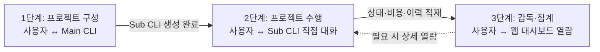

| 단계 | 무엇을 하는가 | 대화 상대 (저장소) |
|---|---|---|
| **1단계 · 프로젝트 구성** | 새 프로젝트 시작, Sub CLI 생성, Skill/문서 레이아웃 준비, `.orchestrator` 구조 생성 | **Main CLI** (파일) — 초기 구성 시에만 |
| **2단계 · 프로젝트 수행** | 프로젝트 진행 중 지시·질의·승인 처리 등 실무 대화 | **Sub CLI 직접 대화** (프로젝트 내 파일). Main은 개입 ✗ |
| **3단계 · 감독·비용·이력** | 여러 Sub의 상태·비용·이력·리포트 종합 감독, 필요 시 Sub 상세 팝업 열람 | **웹 대시보드** (PostgreSQL DB). 직접 CLI 대화 ✗ |

- **진실 소스는 파일(Main/Sub의 `.orchestrator/*.md`)**, DB는 감독용 파생 뷰. Hooks가 이중 기록.
- 아래 §1.1~§1.3 플로우는 위 3단계 중 어디에 해당하는지를 명시하는 형태로 읽으면 된다.

### 1.1 최초 접속 -> 온보딩 -> 일상 운영

```mermaid
flowchart TD
    START([브라우저 접속]) --> AUTH{최초 접속?}
    AUTH -->|Yes| SB002[SB-002 비밀번호 설정]
    AUTH -->|No| SB001[SB-001 로그인]
    
    SB002 --> DASH_EMPTY[대시보드 - 빈 상태]
    SB001 --> CHECK{부서 존재?}
    
    CHECK -->|No| DASH_EMPTY
    CHECK -->|Yes| DASH[대시보드 - 4컬럼 뷰]
    
    DASH_EMPTY --> CHAT_ONBOARD[채팅 컬럼 - 온보딩 대화]
    CHAT_ONBOARD --> SKILL_LIB[Skill 라이브러리 모달]
    SKILL_LIB --> SKILL_FORM[Skill 입력 폼]
    SKILL_FORM --> PART_CREATE[Part 생성 완료]
    PART_CREATE --> DASH
    
    DASH --> DAILY{일상 운영 루프}
    DAILY --> MONITOR[모니터링]
    DAILY --> COMMAND[지시/제어]
    DAILY --> APPROVE[승인 처리]
    DAILY --> RESOURCE[리소스 관리]
    DAILY --> SETTINGS[설정 관리]
    
    MONITOR --> DASH
    COMMAND --> CHAT_COL[채팅 컬럼]
    APPROVE --> APPROVAL[승인 처리 (Activity/Chat 컬럼)]
    RESOURCE --> RESOURCE_PAGE[Resources 페이지]
    SETTINGS --> SETTINGS_PAGE[Settings 페이지]
```

### 1.2 데스크톱 메인 뷰 전환 흐름

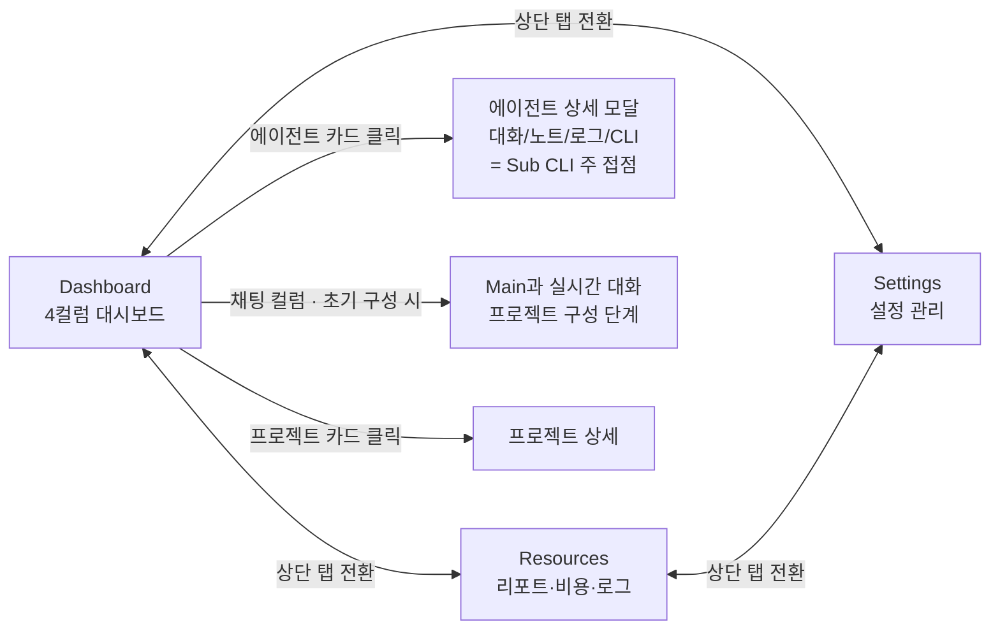

> DR001 적용 포인트: **채팅 컬럼(Main 대화)** 은 1단계(프로젝트 구성)의 창구이고, **에이전트 상세 모달의 대화 탭(SCR-AGENT-001)** 은 2단계(프로젝트 수행)에서 Sub CLI와 직접 대화하는 주 접점이다. Dashboard 자체는 3단계(감독) 뷰다.

### 1.3 모바일 뷰 전환 흐름

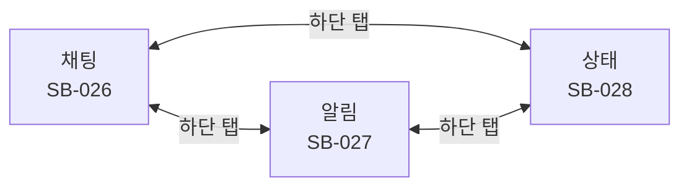

---

## 2. 주요 태스크 플로우

### 2.1 Part(부서) 생성 플로우

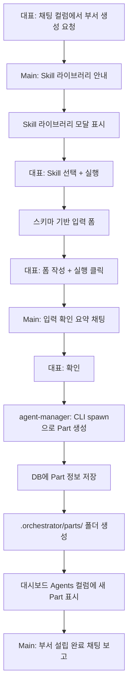

### 2.2 프로젝트 실행 플로우

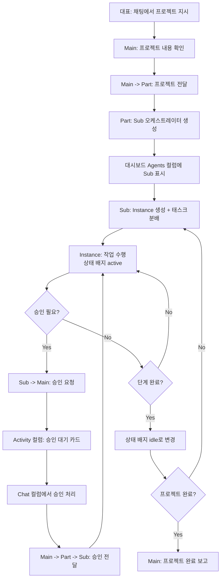

### 2.3 승인 처리 플로우

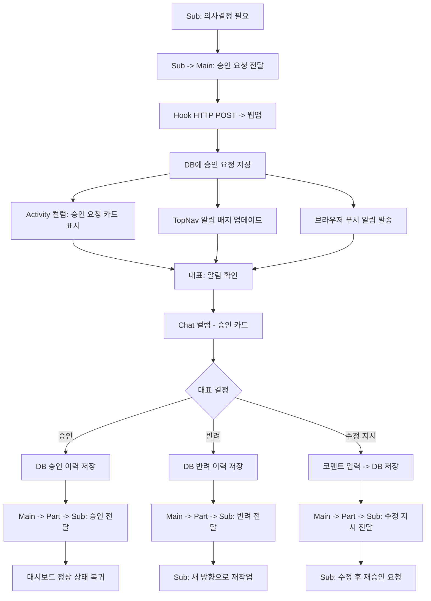

### 2.4 오류 대응 플로우

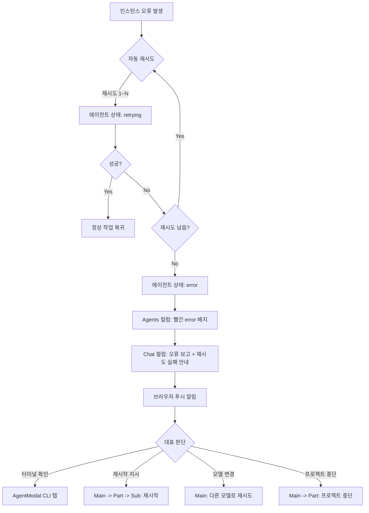

### 2.5 서버 복구 플로우

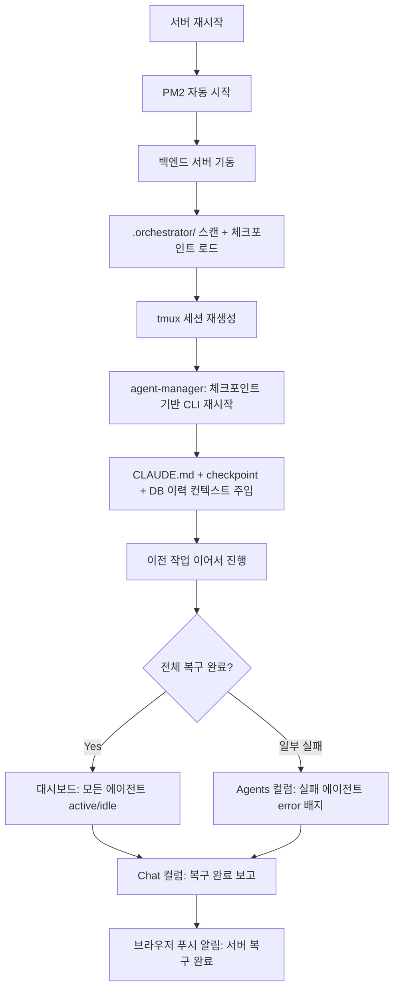

### 2.6 모바일 승인 처리 플로우

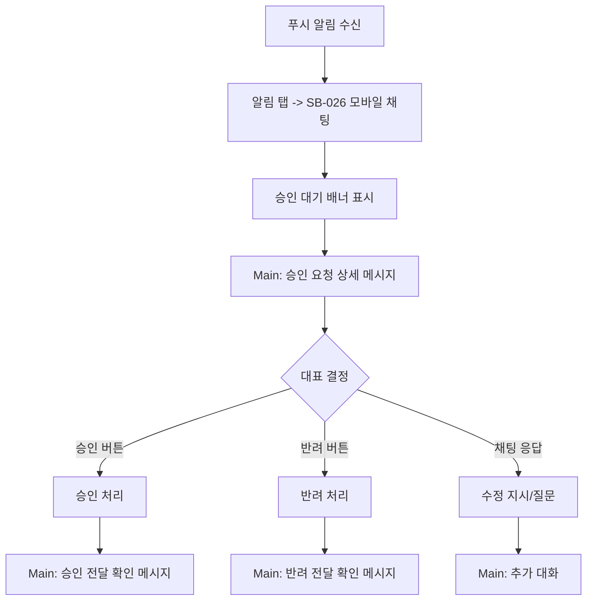

### 2.7 비용 모니터링 플로우

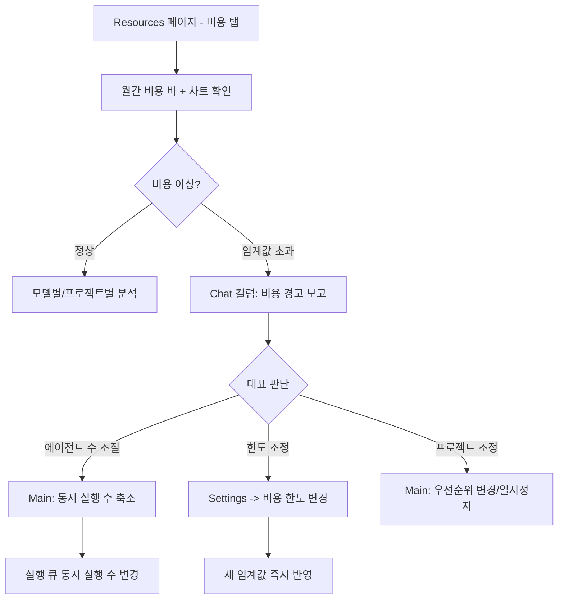

### 2.8 설정 변경 플로우

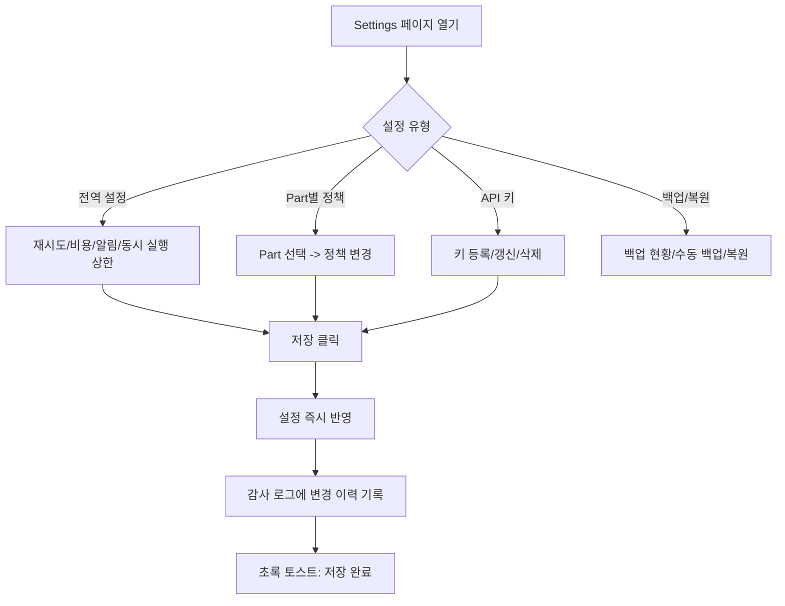

---

## 3. 화면 접근 맵

### 3.1 Dashboard에서 접근 가능한 화면

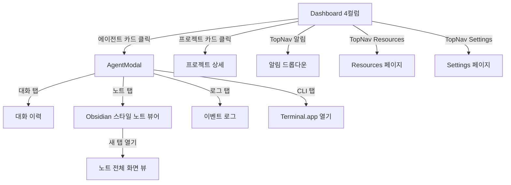

### 3.2 Chat 컬럼에서 접근 가능한 화면

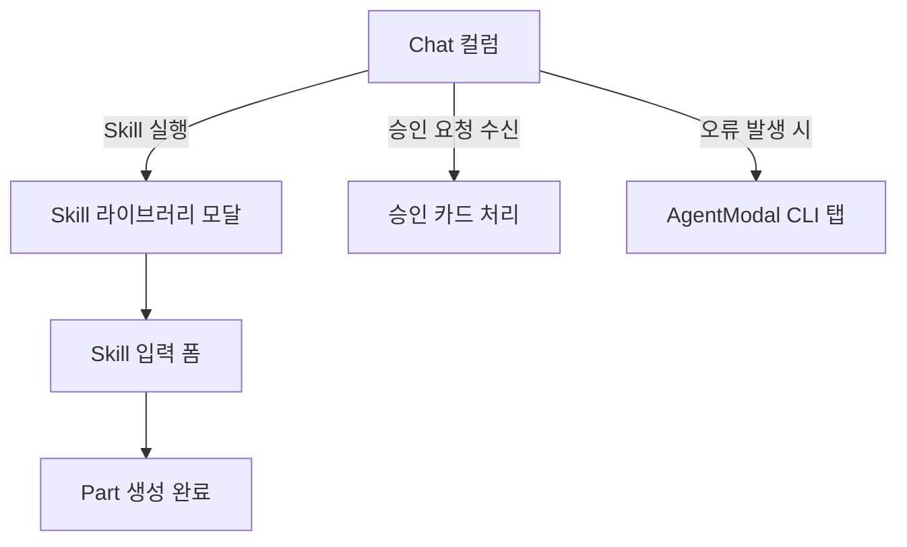

---

## 4. 데스크톱 / 모바일 분기

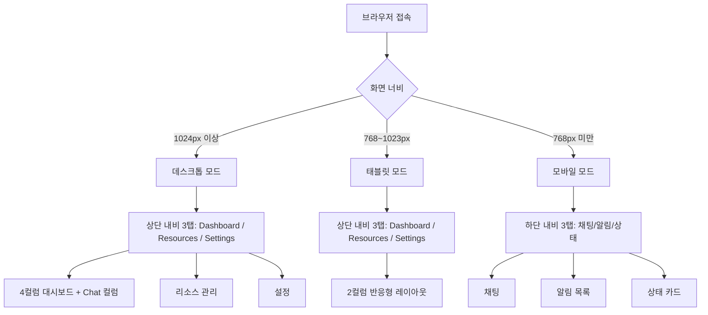

### 데스크톱 전용 기능
- 4컬럼 SugarCRM 대시보드 (Projects / Agents / Activity / Chat)
- AgentModal (에이전트 카드 클릭 - 대화/노트/로그/CLI)
- Obsidian 스타일 노트 뷰어 (새 탭 열기 지원)
- Resources 페이지 (리포트 + 비용/로그/감사이력)
- 시스템 헬스 패널
- Settings 페이지
- 대화 흐름 트리 뷰
- 프로젝트 우선순위 드래그 재정렬

### 모바일 전용 기능
- 하단 3탭 내비게이션 (채팅/알림/상태)
- 상태 카드 뷰 (Part/Sub별 요약 카드)
- 인라인 승인 버튼 (채팅 내)
- 간소화된 알림 목록

### 공통 기능
- 로그인/비밀번호 설정
- 채팅 (Main과 대화 — 데스크톱: Chat 컬럼, 모바일: 별도 화면)
- 승인 처리 (채팅 내 버튼)
- 푸시 알림 수신

---

## 5. 시나리오별 화면 흐름 매핑

| 시나리오 | 주요 화면 흐름 | 분기 |
|---|---|---|
| SC-001 온보딩 | Login → Setup → Dashboard(빈) → Chat 컬럼 | 최초만 Setup |
| SC-002 Part 생성 | Chat 컬럼 → Skill 라이브러리 → 입력 폼 → Dashboard | |
| SC-003 프로젝트 진행 | Chat 컬럼 → Dashboard (Projects/Agents 컬럼 업데이트) | |
| SC-004 승인 처리 | Activity 컬럼 → Chat 컬럼 (승인 카드) | |
| SC-005 활동 열람 | Agents 컬럼 → AgentModal (대화/노트/로그/CLI 탭) | 탭 선택 |
| SC-006 오류/재시도 | Agents 컬럼 (error 배지) → Chat 컬럼 → AgentModal CLI 탭 | |
| SC-007 비용 모니터링 | Resources (비용 탭) → Chat 컬럼 (조절 대화) | |
| SC-008 리포트 열람 | Resources (리포트 탭) → Chat 컬럼 | |
| SC-009 모바일 승인 | 모바일 채팅 (승인 처리) | 모바일 전용 |
| SC-010 서버 복구 | PM2 자동 → 체크포인트 복원 → Dashboard | |
| SC-011 API 키 관리 | Chat 컬럼 (대화) + Settings (API 키) | |
| SC-012 설정 변경 | Settings 페이지 → Part 정책 | |
| SC-013 능동적 지시 | Chat 컬럼 | |
| SC-014 검색/필터링 | Resources 페이지 | |
| SC-015 백업/복원 | Settings (백업 섹션) | |
| SC-016 리소스 관리 | Chat 컬럼 + Settings | |
| SC-017 시스템 헬스 | Resources (헬스 탭) | |
| SC-018 Skill 작성 | Chat 컬럼 → Skill 라이브러리 → 입력 폼 → Part 생성 | |
| SC-019 생명주기 관리 | Chat 컬럼 → Dashboard | |
| SC-020 마이그레이션 | Chat 컬럼 (대화) + CLI | |
| SC-021 인프라 배포 | CLI → Login → Dashboard | |
| SC-022 대화 흐름 추적 | Resources (흐름 트리) → AgentModal (대화 탭) | |
| SC-023 이중 저장 | Dashboard + Resources (실시간 반영) | |
| SC-024 알림 트리거 | 알림 드롭다운 → 각 상세 화면 | |
| SC-025 뷰 전환 | Dashboard ↔ Resources ↔ Settings | |
| SC-026 에이전트 실행 | Chat 컬럼 (CLI spawn) → Dashboard (상태 반영) | |
| SC-027 모바일 뷰 | 모바일 채팅 → 알림 → 상태 | 모바일 전용 |
| SC-028 민감도 관리 | Settings (Part 정책) + Chat 컬럼 | |
| SC-029 노트 구조 | AgentModal (노트 탭) → 새 탭 노트 뷰 | |
| SC-030 우선순위 관리 | Projects 컬럼 (드래그 재정렬/드롭다운) → 실행 큐 반영 | |
