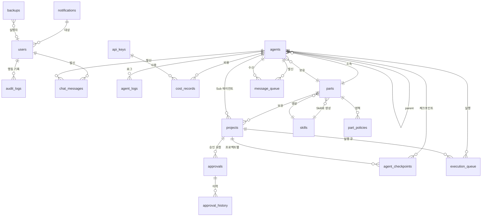

# 데이터베이스 설계 (ERD)
> 작성: designer | 상태: 작성 완료 | 최종 갱신: 2026-09-14
> PostgreSQL + Drizzle ORM (drizzle-orm/pg-core) 기반 테이블 정의
> 연결 문자열·포트는 [[📇 facts#접속 문자열]] 참조 (값의 단일 소스)

---

## 1. ERD 다이어그램



---

## 2. 테이블 정의

### 2.1 users (사용자)

```typescript
export const users = pgTable('users', {
  id: serial('id').primaryKey(),
  passwordHash: text('password_hash').notNull(),
  createdAt: text('created_at').notNull().default(sql`now()::text`),
  updatedAt: text('updated_at').notNull().default(sql`now()::text`),
});
```

### 2.2 agents (에이전트)

```typescript
export const agents = pgTable('agents', {
  id: text('id').primaryKey(),                    // UUID
  name: text('name').notNull(),                   // "Main", "Finance Sub" 등
  role: text('role').notNull(),                   // 'main' | 'part' | 'sub' | 'instance'
  status: text('status').notNull().default('idle'), // 'active' | 'idle' | 'pending' | 'error' | 'stopped' | 'retrying'
  partId: text('part_id').references(() => parts.id),
  parentId: text('parent_id'),                    // 자기 참조 (트리 구조)
  tmuxSession: text('tmux_session'),              // tmux 세션 ID
  cliSessionId: text('cli_session_id'),           // Claude CLI 세션 ID (--resume 용)
  modelName: text('model_name'),                  // 사용 모델명
  modelProvider: text('model_provider'),          // 'anthropic' | 'openai' 등
  taskType: text('task_type'),                    // 인스턴스의 태스크 유형
  statusMessage: text('status_message'),          // "Working...", "Completed" 등 상태 메시지
  notesPath: text('notes_path'),                  // .orchestrator 노트 경로
  projectRoot: text('project_root'),              // CLI 실행 기준 디렉토리
  startedAt: text('started_at'),
  stoppedAt: text('stopped_at'),
  createdAt: text('created_at').notNull().default(sql`now()::text`),
  updatedAt: text('updated_at').notNull().default(sql`now()::text`),
}, (table) => [
  index('idx_agents_part').on(table.partId),
  index('idx_agents_parent').on(table.parentId),
  index('idx_agents_status').on(table.status),
  index('idx_agents_role').on(table.role),
  // Main 은 하나뿐이라는 규칙을 DB 제약으로 강제한다 (0006).
  // init-main 의 "조회 → 없으면 삽입" 이 동시 요청에서 중복을 만들었다.
  uniqueIndex('ux_agents_single_main').on(table.role).where(sql`role = 'main'`),
]);
```

### 2.3 parts (Part / 부서)

```typescript
export const parts = pgTable('parts', {
  id: text('id').primaryKey(),                    // UUID
  name: text('name').notNull(),                   // "Finance", "DevOps" 등
  description: text('description'),
  skillName: text('skill_name').notNull(),        // "finance-part"
  skillVersion: text('skill_version').notNull(),  // "1.0.0"
  sensitivityLevel: text('sensitivity_level').notNull().default('normal'), // 'critical' | 'sensitive' | 'normal'
  modelProvider: text('model_provider'),          // MODEL_ROUTING 기본값
  color: text('color'),                           // Part 고유 색상 HEX
  status: text('status').notNull().default('active'), // 'active' | 'paused' | 'stopped'
  inputJson: text('input_json'),                  // Skill 실행 시 입력 JSON
  orchestratorPath: text('orchestrator_path'),    // .orchestrator/parts/xxx 경로
  createdAt: text('created_at').notNull().default(sql`now()::text`),
  updatedAt: text('updated_at').notNull().default(sql`now()::text`),
});
```

### 2.4 skills (Skill 메타데이터)

```typescript
export const skills = pgTable('skills', {
  id: serial('id').primaryKey(),
  name: text('name').notNull().unique(),          // "finance-part"
  displayName: text('display_name').notNull(),    // "Finance 관리"
  description: text('description'),
  version: text('version').notNull(),             // "1.0.0"
  parentSkill: text('parent_skill'),              // "base-part" (단일 상속)
  schemaJson: text('schema_json'),                // JSON 스키마 정의
  filePath: text('file_path').notNull(),          // ~/.claudemanager/skills/finance-part.sh
  createdAt: text('created_at').notNull().default(sql`now()::text`),
  updatedAt: text('updated_at').notNull().default(sql`now()::text`),
});
```

### 2.5 projects (프로젝트)

```typescript
export const projects = pgTable('projects', {
  id: text('id').primaryKey(),                    // UUID
  name: text('name').notNull(),                   // "투자 분석 자동화"
  partId: text('part_id').notNull().references(() => parts.id),
  subAgentId: text('sub_agent_id').references(() => agents.id),
  status: text('status').notNull().default('active'), // 'active' | 'paused' | 'stopped' | 'completed'
  currentStage: text('current_stage'),            // "기획" | "디자인" | "개발" | "테스트" | "리뷰" | "배포"
  progressPercent: integer('progress_percent').default(0),
  priority: text('priority').notNull().default('normal'), // 'urgent' | 'high' | 'normal' | 'low'
  startedAt: text('started_at'),
  completedAt: text('completed_at'),
  createdAt: text('created_at').notNull().default(sql`now()::text`),
  updatedAt: text('updated_at').notNull().default(sql`now()::text`),
}, (table) => [
  index('idx_projects_part').on(table.partId),
  index('idx_projects_status').on(table.status),
  index('idx_projects_priority').on(table.priority),
]);
```

### 2.6 chat_messages (채팅 메시지)

```typescript
export const chatMessages = pgTable('chat_messages', {
  id: text('id').primaryKey(),                    // UUID
  sender: text('sender').notNull(),               // 'user' | 에이전트명
  content: text('content').notNull(),
  messageType: text('message_type').notNull().default('text'), // 'text' | 'approval_request' | 'progress' | 'system' | 'error'
  metadata: text('metadata'),                     // JSON (agentId 등)
  createdAt: text('created_at').notNull().default(sql`now()::text`),
}, (table) => [
  index('idx_chat_sender').on(table.sender),
  index('idx_chat_created').on(table.createdAt),
]);
```

### 2.7 approvals (승인 요청)

```typescript
export const approvals = pgTable('approvals', {
  id: text('id').primaryKey(),                    // UUID
  projectId: text('project_id').references(() => projects.id),
  sourceAgentId: text('source_agent_id').references(() => agents.id),
  title: text('title').notNull(),
  content: text('content').notNull(),
  urgency: text('urgency').notNull().default('normal'), // 'low' | 'normal' | 'high' | 'critical'
  status: text('status').notNull().default('pending'), // 'pending' | 'approved' | 'rejected' | 'modified'
  resolution: text('resolution'),
  resolvedAt: text('resolved_at'),
  createdAt: text('created_at').notNull().default(sql`now()::text`),
}, (table) => [
  index('idx_approvals_status').on(table.status),
  index('idx_approvals_project').on(table.projectId),
  index('idx_approvals_created').on(table.createdAt),
]);
```

### 2.8 approval_history (승인 이력)

```typescript
export const approvalHistory = pgTable('approval_history', {
  id: serial('id').primaryKey(),
  approvalId: text('approval_id').notNull().references(() => approvals.id),
  action: text('action').notNull(),               // 'approved' | 'rejected' | 'modified' | 'requested'
  comment: text('comment'),
  actorType: text('actor_type').notNull(),        // 'user' | 'agent'
  actorId: text('actor_id'),
  createdAt: text('created_at').notNull().default(sql`now()::text`),
}, (table) => [
  index('idx_approval_hist_approval').on(table.approvalId),
]);
```

### 2.9 api_keys (API 키 관리)

```typescript
export const apiKeys = pgTable('api_keys', {
  id: serial('id').primaryKey(),
  provider: text('provider').notNull(),           // 'anthropic' | 'openai' | 'google' 등
  keyEncrypted: text('key_encrypted').notNull(),  // AES-256-GCM 암호화
  keyIv: text('key_iv').notNull(),                // 초기화 벡터
  keyTag: text('key_tag').notNull(),              // 인증 태그
  keyMasked: text('key_masked').notNull(),        // "sk-ant-xxx...xxx" (표시용)
  status: text('status').notNull().default('active'), // 'active' | 'expired' | 'revoked'
  expiresAt: text('expires_at'),
  monthlyUsage: doublePrecision('monthly_usage').default(0),
  createdAt: text('created_at').notNull().default(sql`now()::text`),
  updatedAt: text('updated_at').notNull().default(sql`now()::text`),
});
```

### 2.10 cost_records (비용/토큰 기록)

```typescript
export const costRecords = pgTable('cost_records', {
  id: serial('id').primaryKey(),
  agentId: text('agent_id').references(() => agents.id),
  apiKeyId: integer('api_key_id').references(() => apiKeys.id),
  modelName: text('model_name').notNull(),
  inputTokens: integer('input_tokens').notNull(),
  outputTokens: integer('output_tokens').notNull(),
  cost: doublePrecision('cost').notNull(),        // USD
  projectId: text('project_id').references(() => projects.id),
  createdAt: text('created_at').notNull().default(sql`now()::text`),
}, (table) => [
  index('idx_cost_agent').on(table.agentId),
  index('idx_cost_model').on(table.modelName),
  index('idx_cost_project').on(table.projectId),
  index('idx_cost_created').on(table.createdAt),
]);
```

### 2.11 notifications (알림)

```typescript
export const notifications = pgTable('notifications', {
  id: serial('id').primaryKey(),
  type: text('type').notNull(),                   // 'approval' | 'error' | 'complete' | 'cost' | 'recovery' | 'info'
  title: text('title').notNull(),
  message: text('message').notNull(),
  sourceAgentId: text('source_agent_id').references(() => agents.id),
  targetUrl: text('target_url'),                  // 클릭 시 이동할 URL
  isRead: boolean('is_read').default(false),
  createdAt: text('created_at').notNull().default(sql`now()::text`),
}, (table) => [
  index('idx_notif_type').on(table.type),
  index('idx_notif_read').on(table.isRead),
  index('idx_notif_created').on(table.createdAt),
]);
```

### 2.12 audit_logs (감사 로그)

```typescript
export const auditLogs = pgTable('audit_logs', {
  id: serial('id').primaryKey(),
  actorType: text('actor_type').notNull(),        // 'user' | 'agent' | 'system'
  actorId: text('actor_id'),
  action: text('action').notNull(),               // 'approve' | 'reject' | 'command' | 'create_part' | 'create_sub' 등
  resource: text('resource').notNull(),           // 'approval' | 'project' | 'settings' | 'agent' | 'part' 등
  resourceId: text('resource_id'),
  detail: text('detail'),                         // JSON 상세
  createdAt: text('created_at').notNull().default(sql`now()::text`),
}, (table) => [
  index('idx_audit_actor').on(table.actorType),
  index('idx_audit_action').on(table.action),
  index('idx_audit_resource').on(table.resource),
  index('idx_audit_created').on(table.createdAt),
]);
```

### 2.13 agent_logs (에이전트 행동 로그)

```typescript
export const agentLogs = pgTable('agent_logs', {
  id: serial('id').primaryKey(),
  agentId: text('agent_id').notNull().references(() => agents.id),
  eventType: text('event_type').notNull(),        // 'started' | 'completed' | 'error' | 'retry' | 'token_usage' 등
  message: text('message'),
  detail: text('detail'),                         // JSON (에러 메시지, 스택 트레이스 등)
  inputTokens: integer('input_tokens'),
  outputTokens: integer('output_tokens'),
  cost: doublePrecision('cost'),
  createdAt: text('created_at').notNull().default(sql`now()::text`),
}, (table) => [
  index('idx_agent_logs_agent').on(table.agentId),
  index('idx_agent_logs_event').on(table.eventType),
  index('idx_agent_logs_created').on(table.createdAt),
]);
```

### 2.14 part_policies (Part별 정책)

```typescript
export const partPolicies = pgTable('part_policies', {
  id: serial('id').primaryKey(),
  partId: text('part_id').notNull().references(() => parts.id).unique(),
  retryCount: integer('retry_count').notNull().default(3),
  retryStrategy: text('retry_strategy').notNull().default('exponential'), // 'exponential' | 'fixed'
  retryIntervalBase: integer('retry_interval_base').notNull().default(10), // 초
  approvalStages: text('approval_stages'),        // JSON: ["기획완료", "디자인완료"] 등
  defaultModel: text('default_model'),
  createdAt: text('created_at').notNull().default(sql`now()::text`),
  updatedAt: text('updated_at').notNull().default(sql`now()::text`),
});
```

### 2.15 settings (전역 설정)

```typescript
export const settings = pgTable('settings', {
  key: text('key').primaryKey(),
  value: text('value').notNull(),                 // JSON 문자열
  updatedAt: text('updated_at').notNull().default(sql`now()::text`),
});
```

### 2.16 backups (백업 이력)

```typescript
export const backups = pgTable('backups', {
  id: serial('id').primaryKey(),
  type: text('type').notNull(),                   // 'auto' | 'manual'
  status: text('status').notNull(),               // 'completed' | 'failed' | 'in_progress'
  filePath: text('file_path'),
  sizeBytes: integer('size_bytes'),
  errorMessage: text('error_message'),
  createdAt: text('created_at').notNull().default(sql`now()::text`),
});
```

### 2.17 system_health (시스템 헬스 시계열)

```typescript
export const systemHealth = pgTable('system_health', {
  id: serial('id').primaryKey(),
  cpuPercent: doublePrecision('cpu_percent').notNull(),
  memoryPercent: doublePrecision('memory_percent').notNull(),
  diskPercent: doublePrecision('disk_percent').notNull(),
  networkUpMbps: doublePrecision('network_up_mbps'),
  networkDownMbps: doublePrecision('network_down_mbps'),
  activeAgents: integer('active_agents').notNull(),
  createdAt: text('created_at').notNull().default(sql`now()::text`),
}, (table) => [
  index('idx_health_created').on(table.createdAt),
]);
```

### 2.18 agent_checkpoints (에이전트 체크포인트)

```typescript
export const agentCheckpoints = pgTable('agent_checkpoints', {
  id: serial('id').primaryKey(),
  agentId: text('agent_id').notNull().references(() => agents.id),
  projectId: text('project_id').references(() => projects.id),
  currentStage: text('current_stage').notNull(),
  completedTasks: text('completed_tasks'),           // JSON: ["task1", "task2"]
  pendingTasks: text('pending_tasks'),               // JSON: ["task3", "task4"]
  contextSnapshot: text('context_snapshot'),          // CLAUDE.md + 주요 컨텍스트 요약
  lastOutputHash: text('last_output_hash'),
  metadata: text('metadata'),                        // JSON: 추가 상태 정보
  createdAt: text('created_at').notNull().default(sql`now()::text`),
}, (table) => [
  index('idx_checkpoint_agent').on(table.agentId),
  index('idx_checkpoint_project').on(table.projectId),
  index('idx_checkpoint_created').on(table.createdAt),
]);
```

### 2.19 message_queue (메시지 큐)

```typescript
export const messageQueue = pgTable('message_queue', {
  id: text('id').primaryKey(),                       // UUID
  fromAgentId: text('from_agent_id').references(() => agents.id),
  toAgentId: text('to_agent_id').references(() => agents.id),
  content: text('content').notNull(),
  messageType: text('message_type').notNull(),       // 'instruction' | 'report' | 'approval' | 'error'
  status: text('status').notNull().default('created'), // 'created' | 'sent' | 'delivered' | 'processed' | 'failed'
  retryCount: integer('retry_count').default(0),
  maxRetries: integer('max_retries').default(3),
  lastRetryAt: text('last_retry_at'),
  errorDetail: text('error_detail'),
  createdAt: text('created_at').notNull().default(sql`now()::text`),
  updatedAt: text('updated_at').notNull().default(sql`now()::text`),
}, (table) => [
  index('idx_mq_status').on(table.status),
  index('idx_mq_from').on(table.fromAgentId),
  index('idx_mq_to').on(table.toAgentId),
  index('idx_mq_created').on(table.createdAt),
]);
```

### 2.20 execution_queue (실행 큐)

```typescript
export const executionQueue = pgTable('execution_queue', {
  id: text('id').primaryKey(),                       // UUID
  projectId: text('project_id').references(() => projects.id),
  agentId: text('agent_id').references(() => agents.id),
  taskDescription: text('task_description').notNull(),
  priority: text('priority').notNull().default('normal'), // 'urgent' | 'high' | 'normal' | 'low'
  status: text('status').notNull().default('queued'), // 'queued' | 'running' | 'completed' | 'failed' | 'cancelled'
  startedAt: text('started_at'),
  completedAt: text('completed_at'),
  result: text('result'),                            // JSON: 실행 결과
  createdAt: text('created_at').notNull().default(sql`now()::text`),
}, (table) => [
  index('idx_eq_priority').on(table.priority),
  index('idx_eq_status').on(table.status),
  index('idx_eq_project').on(table.projectId),
]);
```

---

## 3. 테이블 관계 요약

| 관계 | 설명 |
|---|---|
| parts -> skills | 1:1 (Skill 하나가 Part 하나를 생성) |
| parts -> agents | 1:N (Part 하위에 여러 에이전트) |
| agents -> agents | 자기 참조 (parent-child 트리) |
| parts -> projects | 1:N (Part 내 여러 프로젝트) |
| projects -> approvals | 1:N (프로젝트에서 여러 승인 요청) |
| approvals -> approval_history | 1:N (승인 건당 여러 이력) |
| agents -> agent_logs | 1:N (에이전트별 여러 로그) |
| agents -> cost_records | 1:N (에이전트별 여러 비용 기록) |
| api_keys -> cost_records | 1:N (키별 여러 비용 기록) |
| agents -> agent_checkpoints | 1:N (에이전트별 여러 체크포인트) |
| agents -> message_queue | 1:N (발신/수신 메시지) |
| agents -> execution_queue | 1:N (에이전트별 실행 큐 항목) |
| projects -> execution_queue | 1:N (프로젝트별 실행 큐 항목) |

---

## 4. 인덱스 전략

| 테이블 | 인덱스 | 용도 |
|---|---|---|
| agents | part_id, parent_id, status, role | 트리 조회, 상태별 필터 |
| projects | part_id, status, priority | Part별 프로젝트 조회, 우선순위 정렬 |
| chat_messages | sender, created_at | 메시지 목록 페이지네이션 |
| approvals | status, project_id, created_at | 대기 목록, 이력 조회 |
| cost_records | agent_id, model_name, project_id, created_at | 비용 집계, 기간별 조회 |
| notifications | type, is_read, created_at | 미읽음 알림 조회 |
| audit_logs | actor_type, action, resource, created_at | 감사 로그 필터링 |
| agent_logs | agent_id, event_type, created_at | 에이전트별 로그 조회 |
| system_health | created_at | 시계열 조회 |
| agent_checkpoints | agent_id, project_id, created_at | 체크포인트 조회/복원 |
| message_queue | status, from_agent_id, to_agent_id, created_at | 메시지 배달 추적 |
| execution_queue | priority, status, project_id | 우선순위 큐 관리 |

---

## 5. Drizzle ORM 타입 매핑 (PostgreSQL)

| Drizzle 함수 | PostgreSQL 타입 | 용도 |
|---|---|---|
| `pgTable()` | CREATE TABLE | 테이블 정의 |
| `serial()` | SERIAL (auto increment) | 자동 증분 PK |
| `text()` | TEXT | 문자열, UUID, JSON 문자열 |
| `integer()` | INTEGER | 정수 |
| `doublePrecision()` | DOUBLE PRECISION | 실수 (비용 등) |
| `boolean()` | BOOLEAN | 불리언 |
| `index()` | CREATE INDEX | 인덱스 (배열 반환) |
| `sql\`now()::text\`` | now()::text | 기본 타임스탬프 |

---

## 6. 데이터 보관 정책

| 데이터 | 보관 기간 | 정리 전략 |
|---|---|---|
| chat_messages | 영구 | 아카이브 (180일 이후) |
| agent_logs | 90일 | 자동 삭제 |
| cost_records | 영구 | 월별 집계 후 상세 90일 보관 |
| system_health | 30일 | 자동 삭제 (1시간 이상 데이터는 평균값으로 압축) |
| audit_logs | 영구 | 삭제 불가 (BR-AUD-03) |
| notifications | 90일 | 읽은 알림 자동 삭제 |
| backups | 30일 | 오래된 백업 자동 삭제 |
| agent_checkpoints | 30일 | 최신 3개만 유지, 나머지 자동 삭제 |
| message_queue | 7일 | processed/failed 상태 자동 삭제 |
| execution_queue | 30일 | completed/cancelled 상태 자동 삭제 |
