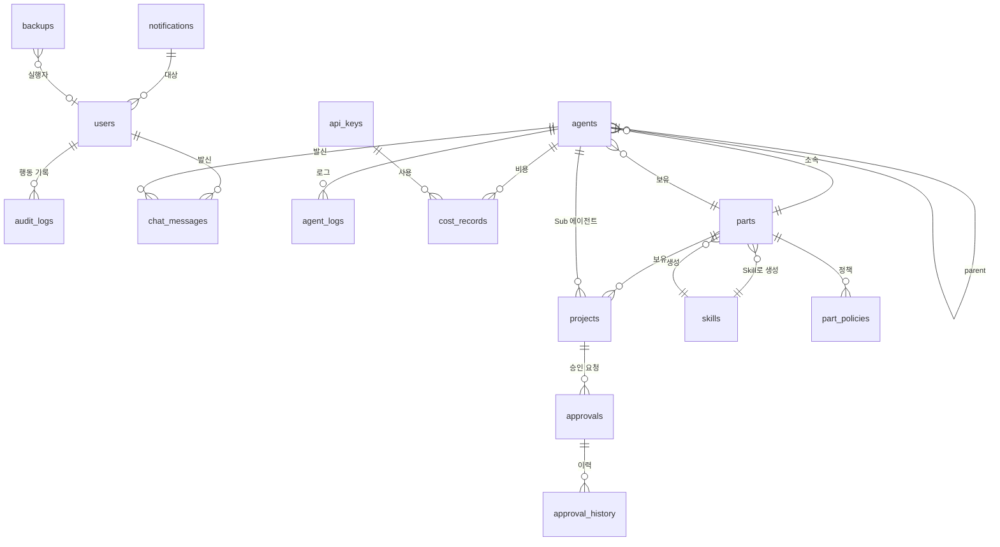

# 데이터베이스 설계 (ERD)
> 작성: designer | 상태: 작성 완료
> SQLite + Drizzle ORM 기반 테이블 정의

---

## 1. ERD 다이어그램



---

## 2. 테이블 정의

### 2.1 users (사용자)

```typescript
// 1인 사용자 시스템이지만 확장성 고려
export const users = sqliteTable('users', {
  id: integer('id').primaryKey({ autoIncrement: true }),
  passwordHash: text('password_hash').notNull(),
  createdAt: text('created_at').notNull().default(sql`(datetime('now'))`),
  updatedAt: text('updated_at').notNull().default(sql`(datetime('now'))`),
});
```

### 2.2 agents (에이전트)

```typescript
export const agents = sqliteTable('agents', {
  id: text('id').primaryKey(),                    // UUID
  name: text('name').notNull(),                   // "비서실장", "프로젝트관리부 부서장" 등
  role: text('role').notNull(),                   // 'main' | 'part' | 'sub' | 'instance'
  status: text('status').notNull().default('idle'), // 'active' | 'idle' | 'pending' | 'error' | 'stopped' | 'retrying'
  partId: text('part_id').references(() => parts.id),
  parentId: text('parent_id').references(() => agents.id),
  tmuxSession: text('tmux_session'),              // tmux 세션 ID
  modelName: text('model_name'),                  // 인스턴스의 경우 사용 모델
  modelProvider: text('model_provider'),          // 'anthropic' | 'openai' 등
  taskType: text('task_type'),                    // 인스턴스의 태스크 유형
  statusMessage: text('status_message'),          // "기획 중", "개발 완료" 등 말풍선 메시지
  startedAt: text('started_at'),
  stoppedAt: text('stopped_at'),
  createdAt: text('created_at').notNull().default(sql`(datetime('now'))`),
  updatedAt: text('updated_at').notNull().default(sql`(datetime('now'))`),
}, (table) => ({
  partIdx: index('idx_agents_part').on(table.partId),
  parentIdx: index('idx_agents_parent').on(table.parentId),
  statusIdx: index('idx_agents_status').on(table.status),
  roleIdx: index('idx_agents_role').on(table.role),
}));
```

### 2.3 parts (Part / 부서)

```typescript
export const parts = sqliteTable('parts', {
  id: text('id').primaryKey(),                    // UUID
  name: text('name').notNull(),                   // "프로젝트관리부"
  description: text('description'),
  skillName: text('skill_name').notNull(),        // "project-part"
  skillVersion: text('skill_version').notNull(),  // "1.0.0"
  sensitivityLevel: text('sensitivity_level').notNull().default('normal'), // 'critical' | 'sensitive' | 'normal'
  modelProvider: text('model_provider'),          // MODEL_ROUTING 기본값
  color: text('color'),                           // Part 고유 색상 HEX
  status: text('status').notNull().default('active'), // 'active' | 'paused' | 'stopped'
  inputJson: text('input_json'),                  // Skill 실행 시 입력 JSON
  orchestratorPath: text('orchestrator_path'),    // .orchestrator/parts/xxx 경로
  createdAt: text('created_at').notNull().default(sql`(datetime('now'))`),
  updatedAt: text('updated_at').notNull().default(sql`(datetime('now'))`),
});
```

### 2.4 skills (Skill 메타데이터)

```typescript
export const skills = sqliteTable('skills', {
  id: integer('id').primaryKey({ autoIncrement: true }),
  name: text('name').notNull().unique(),          // "project-part"
  displayName: text('display_name').notNull(),    // "프로젝트 관리"
  description: text('description'),
  version: text('version').notNull(),             // "1.0.0"
  parentSkill: text('parent_skill'),              // "base-part" (상속 관계)
  schemaJson: text('schema_json'),                // JSON 스키마 정의
  filePath: text('file_path').notNull(),          // ~/.claudemanager/skills/project-part.sh
  createdAt: text('created_at').notNull().default(sql`(datetime('now'))`),
  updatedAt: text('updated_at').notNull().default(sql`(datetime('now'))`),
});
```

### 2.5 projects (프로젝트)

```typescript
export const projects = sqliteTable('projects', {
  id: text('id').primaryKey(),                    // UUID
  name: text('name').notNull(),                   // "할일관리앱"
  partId: text('part_id').notNull().references(() => parts.id),
  subAgentId: text('sub_agent_id').references(() => agents.id),
  status: text('status').notNull().default('active'), // 'active' | 'paused' | 'stopped' | 'completed'
  currentStage: text('current_stage'),            // "기획" | "디자인" | "개발" | "테스트" | "리뷰" | "배포"
  progressPercent: integer('progress_percent').default(0),
  priority: integer('priority').default(0),       // 0=보통, 1=높음, 2=최우선
  startedAt: text('started_at'),
  completedAt: text('completed_at'),
  createdAt: text('created_at').notNull().default(sql`(datetime('now'))`),
  updatedAt: text('updated_at').notNull().default(sql`(datetime('now'))`),
}, (table) => ({
  partIdx: index('idx_projects_part').on(table.partId),
  statusIdx: index('idx_projects_status').on(table.status),
}));
```

### 2.6 chat_messages (채팅 메시지)

```typescript
export const chatMessages = sqliteTable('chat_messages', {
  id: text('id').primaryKey(),                    // UUID
  sender: text('sender').notNull(),               // 'user' | 'main'
  content: text('content').notNull(),
  messageType: text('message_type').notNull().default('text'), // 'text' | 'approval_request' | 'progress' | 'system'
  metadata: text('metadata'),                     // JSON (승인 요청 상세, 진행률 등)
  createdAt: text('created_at').notNull().default(sql`(datetime('now'))`),
}, (table) => ({
  senderIdx: index('idx_chat_sender').on(table.sender),
  createdAtIdx: index('idx_chat_created').on(table.createdAt),
}));
```

### 2.7 approvals (승인 요청)

```typescript
export const approvals = sqliteTable('approvals', {
  id: text('id').primaryKey(),                    // UUID
  projectId: text('project_id').references(() => projects.id),
  sourceAgentId: text('source_agent_id').references(() => agents.id),
  title: text('title').notNull(),
  content: text('content').notNull(),             // 승인 요청 상세 내용
  urgency: text('urgency').notNull().default('normal'), // 'low' | 'normal' | 'high' | 'critical'
  status: text('status').notNull().default('pending'), // 'pending' | 'approved' | 'rejected' | 'modified'
  resolution: text('resolution'),                 // 승인/반려/수정 코멘트
  resolvedAt: text('resolved_at'),
  createdAt: text('created_at').notNull().default(sql`(datetime('now'))`),
}, (table) => ({
  statusIdx: index('idx_approvals_status').on(table.status),
  projectIdx: index('idx_approvals_project').on(table.projectId),
  createdAtIdx: index('idx_approvals_created').on(table.createdAt),
}));
```

### 2.8 approval_history (승인 이력)

```typescript
export const approvalHistory = sqliteTable('approval_history', {
  id: integer('id').primaryKey({ autoIncrement: true }),
  approvalId: text('approval_id').notNull().references(() => approvals.id),
  action: text('action').notNull(),               // 'approved' | 'rejected' | 'modified' | 'requested'
  comment: text('comment'),
  actorType: text('actor_type').notNull(),        // 'user' | 'agent'
  actorId: text('actor_id'),
  createdAt: text('created_at').notNull().default(sql`(datetime('now'))`),
}, (table) => ({
  approvalIdx: index('idx_approval_hist_approval').on(table.approvalId),
}));
```

### 2.9 api_keys (API 키 관리)

```typescript
export const apiKeys = sqliteTable('api_keys', {
  id: integer('id').primaryKey({ autoIncrement: true }),
  provider: text('provider').notNull(),           // 'anthropic' | 'openai' | 'google' 등
  keyEncrypted: text('key_encrypted').notNull(),  // AES-256-GCM 암호화
  keyIv: text('key_iv').notNull(),                // 초기화 벡터
  keyTag: text('key_tag').notNull(),              // 인증 태그
  keyMasked: text('key_masked').notNull(),        // "sk-ant-xxx...xxx" (표시용)
  status: text('status').notNull().default('active'), // 'active' | 'expired' | 'revoked'
  expiresAt: text('expires_at'),
  monthlyUsage: real('monthly_usage').default(0), // 이번 달 사용량 ($)
  createdAt: text('created_at').notNull().default(sql`(datetime('now'))`),
  updatedAt: text('updated_at').notNull().default(sql`(datetime('now'))`),
});
```

### 2.10 cost_records (비용/토큰 기록)

```typescript
export const costRecords = sqliteTable('cost_records', {
  id: integer('id').primaryKey({ autoIncrement: true }),
  agentId: text('agent_id').references(() => agents.id),
  apiKeyId: integer('api_key_id').references(() => apiKeys.id),
  modelName: text('model_name').notNull(),
  inputTokens: integer('input_tokens').notNull(),
  outputTokens: integer('output_tokens').notNull(),
  cost: real('cost').notNull(),                   // USD
  projectId: text('project_id').references(() => projects.id),
  createdAt: text('created_at').notNull().default(sql`(datetime('now'))`),
}, (table) => ({
  agentIdx: index('idx_cost_agent').on(table.agentId),
  modelIdx: index('idx_cost_model').on(table.modelName),
  projectIdx: index('idx_cost_project').on(table.projectId),
  createdAtIdx: index('idx_cost_created').on(table.createdAt),
}));
```

### 2.11 notifications (알림)

```typescript
export const notifications = sqliteTable('notifications', {
  id: integer('id').primaryKey({ autoIncrement: true }),
  type: text('type').notNull(),                   // 'approval' | 'error' | 'complete' | 'cost' | 'recovery' | 'info'
  title: text('title').notNull(),
  message: text('message').notNull(),
  sourceAgentId: text('source_agent_id').references(() => agents.id),
  targetUrl: text('target_url'),                  // 클릭 시 이동할 URL
  isRead: integer('is_read', { mode: 'boolean' }).default(false),
  createdAt: text('created_at').notNull().default(sql`(datetime('now'))`),
}, (table) => ({
  typeIdx: index('idx_notif_type').on(table.type),
  readIdx: index('idx_notif_read').on(table.isRead),
  createdAtIdx: index('idx_notif_created').on(table.createdAt),
}));
```

### 2.12 audit_logs (감사 로그)

```typescript
export const auditLogs = sqliteTable('audit_logs', {
  id: integer('id').primaryKey({ autoIncrement: true }),
  actorType: text('actor_type').notNull(),        // 'user' | 'agent' | 'system'
  actorId: text('actor_id'),                      // 에이전트 ID 또는 'user'
  action: text('action').notNull(),               // 'approve' | 'reject' | 'command' | 'setting_change' | 'login' 등
  resource: text('resource').notNull(),           // 'approval' | 'project' | 'settings' | 'agent' 등
  resourceId: text('resource_id'),
  detail: text('detail'),                         // JSON 상세 (이전값, 새값 등)
  createdAt: text('created_at').notNull().default(sql`(datetime('now'))`),
}, (table) => ({
  actorIdx: index('idx_audit_actor').on(table.actorType),
  actionIdx: index('idx_audit_action').on(table.action),
  resourceIdx: index('idx_audit_resource').on(table.resource),
  createdAtIdx: index('idx_audit_created').on(table.createdAt),
}));
```

### 2.13 agent_logs (에이전트 행동 로그)

```typescript
export const agentLogs = sqliteTable('agent_logs', {
  id: integer('id').primaryKey({ autoIncrement: true }),
  agentId: text('agent_id').notNull().references(() => agents.id),
  eventType: text('event_type').notNull(),        // 'started' | 'completed' | 'error' | 'retry' | 'token_usage' 등
  message: text('message'),
  detail: text('detail'),                         // JSON (에러 메시지, 스택 트레이스, 토큰/비용 등)
  inputTokens: integer('input_tokens'),
  outputTokens: integer('output_tokens'),
  cost: real('cost'),
  createdAt: text('created_at').notNull().default(sql`(datetime('now'))`),
}, (table) => ({
  agentIdx: index('idx_agent_logs_agent').on(table.agentId),
  eventIdx: index('idx_agent_logs_event').on(table.eventType),
  createdAtIdx: index('idx_agent_logs_created').on(table.createdAt),
}));
```

### 2.14 part_policies (Part별 정책)

```typescript
export const partPolicies = sqliteTable('part_policies', {
  id: integer('id').primaryKey({ autoIncrement: true }),
  partId: text('part_id').notNull().references(() => parts.id).unique(),
  retryCount: integer('retry_count').notNull().default(3),
  retryStrategy: text('retry_strategy').notNull().default('exponential'), // 'exponential' | 'fixed'
  retryIntervalBase: integer('retry_interval_base').notNull().default(10), // 초
  approvalStages: text('approval_stages'),        // JSON: ["기획완료", "디자인완료"] 등
  defaultModel: text('default_model'),
  createdAt: text('created_at').notNull().default(sql`(datetime('now'))`),
  updatedAt: text('updated_at').notNull().default(sql`(datetime('now'))`),
});
```

### 2.15 settings (전역 설정)

```typescript
export const settings = sqliteTable('settings', {
  key: text('key').primaryKey(),                  // 설정 키
  value: text('value').notNull(),                 // 설정 값 (JSON 문자열)
  updatedAt: text('updated_at').notNull().default(sql`(datetime('now'))`),
});

// 기본 설정 키:
// 'retry_count': 3
// 'retry_strategy': 'exponential'
// 'cost_limit': 100
// 'alert_threshold': 80
// 'max_concurrent_agents': 10
```

### 2.16 backups (백업 이력)

```typescript
export const backups = sqliteTable('backups', {
  id: integer('id').primaryKey({ autoIncrement: true }),
  type: text('type').notNull(),                   // 'auto' | 'manual'
  status: text('status').notNull(),               // 'completed' | 'failed' | 'in_progress'
  filePath: text('file_path'),
  sizeBytes: integer('size_bytes'),
  errorMessage: text('error_message'),
  createdAt: text('created_at').notNull().default(sql`(datetime('now'))`),
});
```

### 2.17 system_health (시스템 헬스 시계열)

```typescript
export const systemHealth = sqliteTable('system_health', {
  id: integer('id').primaryKey({ autoIncrement: true }),
  cpuPercent: real('cpu_percent').notNull(),
  memoryPercent: real('memory_percent').notNull(),
  diskPercent: real('disk_percent').notNull(),
  networkUpMbps: real('network_up_mbps'),
  networkDownMbps: real('network_down_mbps'),
  activeAgents: integer('active_agents').notNull(),
  createdAt: text('created_at').notNull().default(sql`(datetime('now'))`),
}, (table) => ({
  createdAtIdx: index('idx_health_created').on(table.createdAt),
}));
```

---

## 3. 테이블 관계 요약

| 관계 | 설명 |
|---|---|
| parts -> skills | 1:1 (Skill 하나가 Part 하나를 생성) |
| parts -> agents | 1:N (Part 하위에 여러 에이전트) |
| agents -> agents | 자기 참조 (parent-child 트리) |
| parts -> projects | 1:N (Part 내 여러 프로젝트) |
| projects -> approvals | 1:N (프로젝트에서 여러 승인 요청) |
| approvals -> approval_history | 1:N (승인 건당 여러 이력) |
| agents -> agent_logs | 1:N (에이전트별 여러 로그) |
| agents -> cost_records | 1:N (에이전트별 여러 비용 기록) |
| api_keys -> cost_records | 1:N (키별 여러 비용 기록) |

---

## 4. 인덱스 전략

| 테이블 | 인덱스 | 용도 |
|---|---|---|
| agents | part_id, parent_id, status, role | 트리 조회, 상태별 필터 |
| projects | part_id, status | Part별 프로젝트 조회 |
| chat_messages | sender, created_at | 메시지 목록 페이지네이션 |
| approvals | status, project_id, created_at | 대기 목록, 이력 조회 |
| cost_records | agent_id, model_name, project_id, created_at | 비용 집계, 기간별 조회 |
| notifications | type, is_read, created_at | 미읽음 알림 조회 |
| audit_logs | actor_type, action, resource, created_at | 감사 로그 필터링 |
| agent_logs | agent_id, event_type, created_at | 에이전트별 로그 조회 |
| system_health | created_at | 시계열 조회 |

---

## 5. 데이터 보관 정책

| 데이터 | 보관 기간 | 정리 전략 |
|---|---|---|
| chat_messages | 영구 | 아카이브 (180일 이후) |
| agent_logs | 90일 | 자동 삭제 |
| cost_records | 영구 | 월별 집계 후 상세 90일 보관 |
| system_health | 30일 | 자동 삭제 (1시간 이상 데이터는 평균값으로 압축) |
| audit_logs | 영구 | 삭제 불가 (BR-AUD-03) |
| notifications | 90일 | 읽은 알림 자동 삭제 |
| backups | 30일 | 오래된 백업 자동 삭제 |
